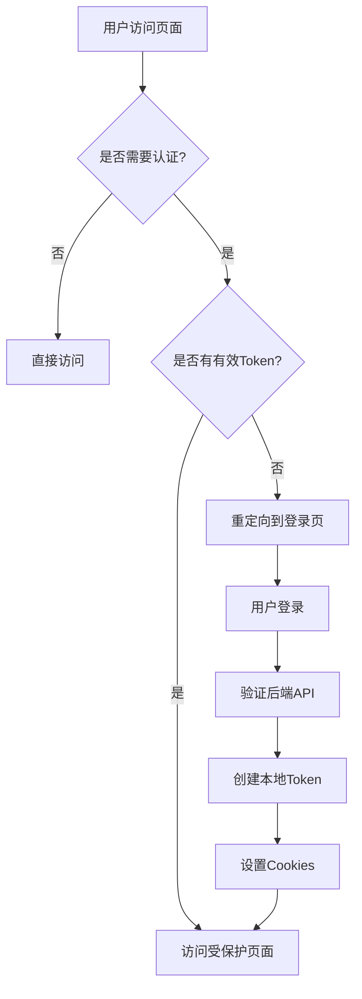

# Gaming Admin 开发进度总结

## 🎯 当前版本状态

**版本**: v1.0.0  
**状态**: ✅ 核心认证系统已完善  
**最后更新**: 2026-02-08

## ✅ 已完成功能

### 1. 项目基础架构

- ✅ Next.js 16.1.6 + TypeScript + Turbopack
- ✅ App Router 架构
- ✅ Shadcn/UI 组件库集成
- ✅ TailwindCSS 样式系统
- ✅ 企业级目录结构规范

### 2. 认证与安全系统

- ✅ **双Token认证架构**
  - 本地JWT Token（会话管理）
  - 后端API Token（Java后端通信）
- ✅ **完整的登录/登出流程**
  - Server Actions 处理表单提交
  - Cookie-based 会话管理
  - 自动重定向和回调URL处理
- ✅ **代理中间件保护**
  - 基于 next-intl 的国际化路由保护
  - 公开/私有路径自动识别
  - 安全头注入（XSS防护、点击劫持等）
- ✅ **用户信息管理**
  - 客户端NavUser组件实时获取用户信息
  - 角色权限基础支持（admin/user）

### 3. 国际化支持

- ✅ next-intl 多语言集成
- ✅ 中英文双语支持（en/zh）
- ✅ 动态路由语言前缀
- ✅ 默认语言：英语（en）
- ✅ 语言切换器组件

### 4. 核心UI组件

- ✅ **登录表单**
  - 国际化文本支持
  - 表单验证（Zod）
  - 密码可见性切换
  - 第三方登录占位
- ✅ **导航系统**
  - 侧边栏导航菜单
  - 用户信息展示
  - 主题切换支持
- ✅ **仪表板框架**
  - 统计卡片
  - 图表区域
  - 快速操作面板

### 5. 开发工具链

- ✅ ESLint + Prettier 代码规范
- ✅ Husky Git hooks
- ✅ TypeScript 严格模式
- ✅ 环境变量验证
- ✅ 统一日志系统

## 🔧 技术栈详情

### 前端框架

- Next.js 16.1.6 (App Router)
- React 19
- TypeScript 5.x

### UI 组件

- Shadcn/UI (基于 Radix UI)
- TailwindCSS 4.0
- Lucide React 图标

### 状态与数据处理

- React Server Components
- Server Actions
- Axios HTTP客户端
- Zod 数据验证

### 认证与安全

- JOSE (JWT处理)
- Next.js Cookies API
- 代理中间件保护

### 国际化

- next-intl
- 动态路由支持

### 开发工具

- Turbopack (极速开发)
- ESLint + Prettier
- Husky Git hooks

## 🚀 企业级架构特点

### 1. 分层架构

```text
┌─────────────────┐
│ Presentation │ ← 组件层 (UI)
├─────────────────┤
│ Application │ ← 业务逻辑层
├─────────────────┤
│ Domain │ ← 领域层 (认证)
├─────────────────┤
│ Infrastructure │ ← 基础设施层
└─────────────────┘

### 2. 模块化设计
- **app/** - 页面和路由
- **components/** - 可复用组件
- **lib/** - 工具和库
- **hooks/** - 自定义Hooks
- **config/** - 配置文件
- **i18n/** - 国际化配置

### 3. 安全特性
- ✅ HTTP-only Cookies
- ✅ JWT签名验证
- ✅ CSRF防护头
- ✅ XSS防护头
- ✅ 点击劫持防护
- ✅ 路径认证中间件

## 📊 测试账号

### 管理员账户
- **邮箱**: admin@example.com
- **密码**: admin123
- **权限**: 系统管理员

### 普通用户账户
- **邮箱**: user@example.com
- **密码**: user123
- **权限**: 普通用户

## 🔄 API 架构

### 前端API路由 (`app/api/`)
- `GET /api/auth/user` - 获取当前用户信息
- `POST /api/auth/logout` - 用户登出

### 后端API客户端 (`lib/api/`)
- 统一的Axios客户端
- 自动Token管理
- 错误拦截和处理
- 支持与Java后端通信

### 认证流程


## 🎨 界面特点

### 响应式设计

- 移动端优先
- 自适应布局
- 暗色/亮色主题

### 用户体验

- 加载状态指示
- 表单即时验证
- 错误友好提示
- 平滑页面过渡

## 🚧 待开发功能

### 高优先级

- 用户管理模块 (CRUD)
- 彩票管理 (Mark6)
- 报表系统
- 数据表格组件完善

### 中优先级

- 实时通知系统
- 文件上传组件
- 图表数据对接
- 权限RBAC系统

### 低优先级

- 多主题支持
- 高级搜索过滤
- 数据导出功能
- 移动端优化

## 📈 性能指标

### 开发环境

- 冷启动: ~800ms
- 热重载: <100ms
- 页面加载: 200-500ms

### 优化特性

- ✅ Turbopack 极速开发
- ✅ 代码分割自动优化
- ✅ 图片优化 (Next/Image)
- ✅ 字体优化 (Next/Font)

## 🛠 开发指南

### 环境设置

```bash
# 1. 克隆项目
git clone <repo>
# 2. 安装依赖
pnpm install
# 3. 配置环境变量
cp .env.example .env.local
# 4. 启动开发服务器
pnpm dev
```

### 代码规范

- 使用TypeScript严格模式
- 遵循ESLint规则
- Prettier自动格式化
- 提交前自动检查

### 提交规范

- feat: 新功能
- fix: 修复bug
- docs: 文档更新
- style: 代码格式
- refactor: 代码重构
- test: 测试相关
- chore: 构建过程

## 🏆 项目里程碑

### 阶段一：基础架构 ✅

- 项目初始化
- 认证系统完成
- 国际化支持
- 开发工具链

## 阶段二：核心功能 🚧

- 用户管理模块
- 彩票管理模块
- 仪表板完善

## 阶段三：高级功能 ⏳

- 报表系统
- 实时功能
- 性能优化

## 📞 技术支持

### 开发问题

- 查看 docs/ 目录文档
- 检查控制台日志
- 使用浏览器开发者工具

### 部署指南

- 生产环境配置
- 性能优化建议
- 安全配置检查

最后更新: 2026-02-08
当前状态: 基础认证系统完善，准备进入核心功能开发

## 📋 下一步计划建议

```sh
# 创建新的功能分支
git checkout -b feat/user-management

# 预计开发：
# 1. 用户列表页面
# 2. 用户CRUD操作
# 3. 用户搜索和过滤
# 4. 角色权限管理
```
