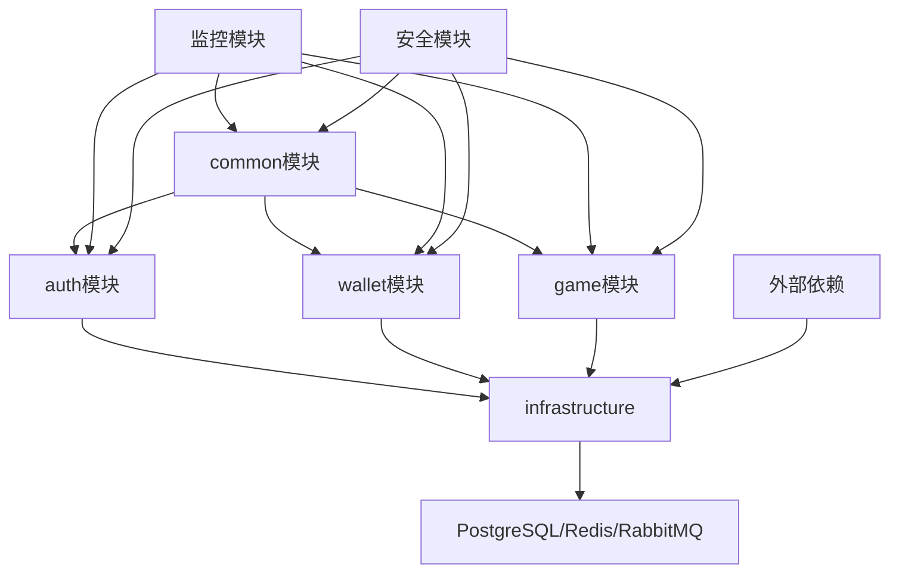

# 📚 Gaming-Server 后端开发完整文档

文档大纲

1. 项目概述
2. 技术栈说明
3. 开发环境搭建
4. 项目结构说明
5. 编码规范
6. API设计规范
7. 数据库设计（已修复）
8. 测试策略
9. 部署流程
10. 安全与合规
11. 监控与运维
12. 常见问题

## 1. 📋 项目概述

### 1.1 项目简介

Gaming-Server 是一个面向亚洲市场的综合性移动端博彩平台，包含彩票、体育投注、真人视讯、棋牌、电竞、电子游戏等多元化游戏产品。

### 1.2 核心功能模块

```kotlin
enum class GameModule {
    LOTTERY,      // 彩票（六合彩、数字彩、双色球等）
    SPORTS,       // 体育投注
    LIVE_CASINO,  // 真人视讯
    POKER,        // 棋牌游戏
    ESPORTS,      // 电竞投注
    SLOTS,        // 电子游戏
    PROMOTION,    // 活动促销
    WALLET,       // 钱包系统
}
```

### 1.3 技术特点

- 跨平台：支持iOS/Android双平台
- 高并发：支持万人同时在线投注
- 实时性：毫秒级开奖结果推送
- 安全性：金融级交易安全保障
- 可扩展：微服务架构，模块化设计
- 合规性：符合数据隐私和安全规范

## 2. 🛠️ 技术栈说明

### 2.1 后端技术栈（纯Kotlin）

```yaml
核心框架:
  - Spring Boot 3.5.0
  - Kotlin 1.9.0
  - Gradle Kotlin DSL

数据层:
  - Spring Data JPA
  - PostgreSQL 17.7（主数据库）
  - Redis 7.0（缓存/会话）
  - Flyway（数据库迁移）
  - HikariCP（连接池）

消息队列:
  - RabbitMQ 3.12

安全认证:
  - Spring Security 6.1
  - JWT + OAuth2
  - Spring Security OAuth2 Resource Server

API文档:
  - Springdoc OpenAPI 3.0

测试框架:
  - Kotest 5.6.0
  - MockK 1.13.7
  - Testcontainers 1.19.0

监控:
  - Micrometer + Prometheus
  - Spring Boot Actuator
```

### 2.2 前端技术栈（Flutter）

```yaml
移动端:
  - Flutter 3.13
  - Dart 3.1
  - state+cubit（状态管理）

管理后台:
  - Next.js 13.5
  - TypeScript 5.2
  - shadcn ui 3.8.2
```

### 2.3 基础设施

```yaml
容器化: Docker + Docker Compose
编排: Kubernetes（生产环境）
CI/CD: GitHub Actions
监控: Prometheus + Grafana + AlertManager
日志: ELK Stack（Elasticsearch + Logstash + Kibana）
追踪: Jaeger（分布式追踪）
存储: MinIO（对象存储）
```

## 3. 💻 开发环境搭建

### 3.1 环境要求

```bash
# 检查环境版本
java -version    # >= OpenJDK 17
kotlin -version  # >= 1.9.0
gradle -version  # >= 8.5
docker --version # >= 20.10
docker-compose --version # >= 2.20
```

### 3.2 本地开发环境配置

#### 步骤1：克隆项目

```bash
git clone https://github.com/Skyler-May/gaming-server.git
cd gaming-server

# 设置git hooks
chmod +x scripts/git-hooks/*
git config core.hooksPath scripts/git-hooks
```

#### 步骤2：配置本地数据库

```bash
# 启动所有依赖服务（PostgreSQL, Redis, RabbitMQ）
docker-compose -f docker/docker-compose.dev.yaml up -d

# 查看服务状态
docker-compose -f docker/docker-compose.dev.yaml ps

# 查看日志
docker-compose -f docker/docker-compose.dev.yaml logs -f
```

#### 步骤3：配置开发环境变量

```bash
# 创建本地配置文件
cp src/main/resources/application-dev-example.yaml src/main/resources/application-dev.yaml

# 编辑配置（根据实际情况修改）
vim src/main/resources/application-dev.yaml
```

#### 步骤4：启动开发服务器

```bash
# 方式1：使用Gradle
./gradlew bootRun --args='--spring.profiles.active=dev'

# 方式2：使用IntelliJ
# 1. 打开IntelliJ IDEA
# 2. 导入项目（选择build.gradle.kts）
# 3. 运行 gamingServerApplication.kt
# 4. 添加VM参数：-Dspring.profiles.active=dev

# 方式3：使用Docker
docker-compose -f docker/docker-compose.dev.yaml up app
```

#### 步骤5：验证安装

```bash
# 检查健康端点
curl http://localhost:8080/actuator/health

# 检查API文档
# 访问 http://localhost:8080/swagger-ui.html
```

#### 3.3 IDE配置（IntelliJ IDEA）

```text
推荐插件:
- Kotlin
- Spring Boot Assistant
- GitToolBox
- Rainbow Brackets
- SonarLint
- Database Navigator（数据库工具）
- Grep Console（日志着色）

代码风格:
File → Settings → Editor → Code Style → Kotlin
- 使用官方Kotlin风格
- 缩进：4个空格
- 行宽：120字符

运行配置:
1. 添加环境变量：SPRING_PROFILES_ACTIVE=dev
2. 添加VM参数：-Dfile.encoding=UTF-8
3. 启用自动编译
```

## 4. 🏗️ 项目结构说明

### 4.1 完整项目结构

```text
gaming-server/
├── src/main/kotlin/com/gaming/server/
│   ├── gamingServerApplication.kt      # 应用启动类
│   │
│   ├── config/                             # 配置类目录
│   │   ├── DatabaseConfig.kt               # 数据库配置
│   │   ├── RedisConfig.kt                  # Redis配置
│   │   ├── RabbitMQConfig.kt               # RabbitMQ配置
│   │   ├── SecurityConfig.kt               # 安全配置
│   │   ├── WebConfig.kt                    # Web配置
│   │   ├── SwaggerConfig.kt                # API文档配置
│   │   ├── CorsConfig.kt                   # 跨域配置
│   │   ├── CacheConfig.kt                  # 缓存配置
│   │   └── AsyncConfig.kt                  # 异步配置
│   │
│   ├── common/                             # 公共模块
│   │   ├── exception/                      # 异常处理
│   │   │   ├── GlobalExceptionHandler.kt   # 全局异常处理器
│   │   │   ├── BusinessException.kt        # 业务异常
│   │   │   ├── ValidationException.kt      # 验证异常
│   │   │   ├── ErrorCode.kt                # 错误码枚举
│   │   │   └── ExceptionHandler.kt         # 异常处理器
│   │   │
│   │   ├── response/                       # 响应封装
│   │   │   ├── ApiResponse.kt              # 统一API响应
│   │   │   ├── PageResult.kt               # 分页结果
│   │   │   └── ResultCode.kt               # 响应码枚举
│   │   │
│   │   ├── annotation/                     # 自定义注解
│   │   │   ├── RateLimit.kt                # 限流注解
│   │   │   ├── LogOperation.kt             # 操作日志注解
│   │   │   ├── DistributedLock.kt          # 分布式锁注解
│   │   │   ├── DataScope.kt                # 数据权限注解
│   │   │   └── SensitiveData.kt            # 敏感数据注解
│   │   │
│   │   ├── util/                           # 工具类
│   │   │   ├── DateUtils.kt                # 日期工具
│   │   │   ├── IdGenerator.kt              # ID生成器（雪花算法）
│   │   │   ├── JsonUtils.kt                # JSON工具
│   │   │   ├── SecurityUtils.kt            # 安全工具
│   │   │   ├── ValidatorUtils.kt           # 验证工具
│   │   │   ├── ExtensionUtils.kt           # 扩展函数
│   │   │   ├── CryptoUtils.kt              # 加密工具
│   │   │   └── MaskUtils.kt                # 数据脱敏工具
│   │   │
│   │   ├── constants/                      # 常量定义
│   │   │   ├── CacheKey.kt                 # 缓存Key常量
│   │   │   ├── GameConstants.kt            # 游戏常量
│   │   │   ├── AppConstants.kt             # 应用常量
│   │   │   └── RedisKey.kt                 # Redis Key模板
│   │   │
│   │   ├── aspect/                         # AOP切面
│   │   │   ├── RateLimitAspect.kt          # 限流切面
│   │   │   ├── LogAspect.kt                # 日志切面
│   │   │   ├── DistributedLockAspect.kt    # 分布式锁切面
│   │   │   └── SensitiveDataAspect.kt      # 敏感数据脱敏切面
│   │   │
│   │   ├── event/                          # 事件定义
│   │   │   ├── DomainEvent.kt              # 领域事件基类
│   │   │   ├── UserEvents.kt               # 用户相关事件
│   │   │   └── WalletEvents.kt             # 钱包相关事件
│   │   │
│   │   └── dto/                            # 公共DTO
│   │       ├── BaseDTO.kt                  # DTO基类
│   │       └── SearchDTO.kt                # 查询DTO
│   │
│   ├── features/                           # 业务功能模块（按功能拆分）
│   │   ├── auth/                           # 认证授权模块
│   │   │   ├── controller/
│   │   │   │   ├── AuthController.kt       # 认证控制器
│   │   │   │   ├── UserController.kt       # 用户控制器
│   │   │   │   └── CaptchaController.kt    # 验证码控制器
│   │   │   │
│   │   │   ├── service/
│   │   │   │   ├── AuthService.kt          # 认证服务
│   │   │   │   ├── UserService.kt          # 用户服务
│   │   │   │   ├── CaptchaService.kt       # 验证码服务
│   │   │   │   ├── TokenService.kt         # Token服务
│   │   │   │   └── PermissionService.kt    # 权限服务
│   │   │   │
│   │   │   ├── dto/
│   │   │   │   ├── request/
│   │   │   │   │   ├── LoginRequest.kt     # 登录请求
│   │   │   │   │   ├── RegisterRequest.kt  # 注册请求
│   │   │   │   │   ├── ResetPasswordRequest.kt
│   │   │   │   │   └── UpdateProfileRequest.kt
│   │   │   │   │
│   │   │   │   └── response/
│   │   │   │       ├── LoginResponse.kt    # 登录响应
│   │   │   │       ├── UserProfileResponse.kt
│   │   │   │       └── PermissionResponse.kt
│   │   │   │
│   │   │   ├── domain/
│   │   │   │   ├── entity/
│   │   │   │   │   ├── User.kt             # 用户实体
│   │   │   │   │   ├── UserRole.kt         # 用户角色
│   │   │   │   │   ├── RolePermission.kt   # 角色权限
│   │   │   │   │   ├── LoginLog.kt         # 登录日志
│   │   │   │   │   └── AuditLog.kt         # 审计日志
│   │   │   │   │
│   │   │   │   ├── vo/
│   │   │   │   │   ├── UserVO.kt           # 用户视图对象
│   │   │   │   │   └── RoleVO.kt           # 角色视图对象
│   │   │   │   │
│   │   │   │   └── enums/
│   │   │   │       ├── UserStatus.kt       # 用户状态
│   │   │   │       ├── LoginType.kt        # 登录类型
│   │   │   │       └── AuditAction.kt      # 审计动作
│   │   │   │
│   │   │   ├── repository/
│   │   │   │   ├── UserRepository.kt       # 用户仓库
│   │   │   │   ├── RoleRepository.kt       # 角色仓库
│   │   │   │   ├── LoginLogRepository.kt   # 登录日志仓库
│   │   │   │   └── AuditLogRepository.kt   # 审计日志仓库
│   │   │   │
│   │   │   └── security/
│   │   │       ├── JwtAuthenticationFilter.kt
│   │   │       ├── JwtTokenProvider.kt
│   │   │       └── CustomUserDetailsService.kt
│   │   │
│   │   ├── wallet/                         # 钱包模块
│   │   ├── lottery/                        # 彩票模块
│   │   ├── sports/                         # 体育投注模块
│   │   ├── promotion/                      # 活动促销模块
│   │   ├── notification/                   # 通知模块
│   │   ├── game/                           # 游戏模块
│   │   └── report/                         # 报表模块
│   │
│   ├── infrastructure/                     # 基础设施层
│   │   ├── mq/                             # 消息队列
│   │   │   ├── producer/
│   │   │   │   ├── BetMessageProducer.kt   # 投注消息生产者
│   │   │   │   ├── WalletMessageProducer.kt
│   │   │   │   └── NotificationProducer.kt
│   │   │   │
│   │   │   ├── consumer/
│   │   │       ├── BetMessageConsumer.kt   # 投注消息消费者
│   │   │       ├── WalletMessageConsumer.kt
│   │   │       └── NotificationConsumer.kt
│   │   │
│   │   ├── cache/                          # 缓存层
│   │   │   ├── RedisCacheService.kt        # Redis缓存服务
│   │   │   ├── CacheKeyBuilder.kt          # 缓存Key构建器
│   │   │   └── CacheEvictService.kt        # 缓存清除服务
│   │   │
│   │   ├── storage/                        # 存储层
│   │   │   ├── FileStorageService.kt       # 文件存储服务
│   │   │   ├── S3StorageService.kt         # S3存储服务
│   │   │   └── ImageProcessor.kt           # 图片处理器
│   │   │
│   │   ├── client/                         # 客户端
│   │   │   ├── SmsClient.kt                # 短信客户端
│   │   │   ├── EmailClient.kt              # 邮件客户端
│   │   │   ├── PaymentClient.kt            # 支付客户端
│   │   │   └── ThirdPartyGameClient.kt     # 第三方游戏客户端
│   │   │
│   │   ├── lock/                           # 分布式锁
│   │   │   ├── RedisDistributedLock.kt
│   │   │   └── DistributedLockFactory.kt
│   │   │
│   │   └── rate/                           # 限流器
│   │       ├── RedisRateLimiter.kt
│   │       └── RateLimitManager.kt
│   │
│   └── job/                                # 定时任务
│       ├── LotteryResultJob.kt             # 开奖任务
│       ├── SettlementJob.kt                # 结算任务
│       ├── DataCleanJob.kt                 # 数据清理任务
│       ├── ReportGenerateJob.kt            # 报表生成任务
│       └── CacheWarmUpJob.kt               # 缓存预热任务
│
├── src/main/resources/
│   ├── application.yaml                    # 主配置文件
│   ├── application-dev.yaml                # 开发环境配置
│   ├── application-prod.yaml               # 生产环境配置
│   ├── application-test.yaml               # 测试环境配置
│   ├── application-staging.yaml            # 预发布环境配置
│   │
│   ├── db/migration/                       # Flyway迁移脚本
│   │   ├── V1__init_schema.sql             # 初始脚本
│   │   ├── V2__add_user_tables.sql         # 用户表
│   │   ├── V3__add_wallet_tables.sql       # 钱包表
│   │   ├── V4__add_game_tables.sql         # 游戏表
│   │   ├── V5__add_audit_tables.sql        # 审计表
│   │   └── V6__add_indexes.sql             # 索引优化
│   │
│   ├── i18n/                               # 国际化文件
│   │   ├── messages.properties             # 默认语言
│   │   ├── messages_zh_CN.properties       # 中文
│   │   ├── messages_en_US.properties       # 英文
│   │   └── messages_th_TH.properties       # 泰文
│   │
│   ├── static/                             # 静态资源
│   │   ├── uploads/                        # 上传文件目录
│   │   ├── templates/                      # 模板文件
│   │   └── swagger/                        # Swagger扩展
│   │
│   ├── templates/                          # 模板文件
│   │   ├── email/                          # 邮件模板
│   │   │   ├── welcome.html                # 欢迎邮件
│   │   │   ├── reset_password.html         # 重置密码
│   │   │   └── verification.html           # 验证邮件
│   │   │
│   │   ├── sms/                            # 短信模板
│   │   │   ├── verification.txt            # 验证码短信
│   │   │   └── notification.txt            # 通知短信
│   │   │
│   └── META-INF/                           # 元数据
│       └── additional-spring-configuration-metadata.json
│
├── src/test/kotlin/com/gaming/server/  # 测试代码
│   ├── common/                             # 公共测试
│   │   ├── TestContainersConfig.kt         # 测试容器配置
│   │   ├── BaseIntegrationTest.kt          # 基础集成测试
│   │   ├── TestDataFactory.kt              # 测试数据工厂
│   │   └── TestSecurityConfig.kt           # 测试安全配置
│   │
│   ├── features/                           # 功能测试
│   │   ├── auth/
│   │   │   ├── AuthControllerTest.kt
│   │   │   ├── AuthServiceTest.kt
│   │   │   └── UserServiceTest.kt
│   │   │
│   │   ├── wallet/
│   │   │   ├── WalletControllerTest.kt
│   │   │   └── WalletServiceTest.kt
│   │   │
│   │   └── game/
│   │       └── LotteryServiceTest.kt
│   │
│   ├── integration/                        # 集成测试
│   │   ├── ApiIntegrationTest.kt
│   │   ├── DatabaseIntegrationTest.kt
│   │   └── RedisIntegrationTest.kt
│   │
│   └── performance/                        # 性能测试
│       ├── UserLoadTest.kt
│       ├── WalletLoadTest.kt
│       └── GameLoadTest.kt
│
├── docker/                                 # Docker配置
│   ├── Dockerfile                          # 主应用镜像
│   ├── Dockerfile.dev                      # 开发环境镜像
│   ├── docker-compose.dev.yaml             # 开发环境编排
│   ├── docker-compose.test.yaml            # 测试环境编排
│   ├── docker-compose.staging.yaml         # 预发布环境编排
│   ├── postgresql/                         # PostgreSQL配置
│   │   ├── init.sql                        # 初始化脚本
│   │   ├── postgresql.conf                 # PostgreSQL配置
│   │   └── pg_hba.conf                     # 访问控制
│   ├── redis/                              # Redis配置
│   │   └── redis.conf
│   └── prometheus/                         # Prometheus配置
│       └── prometheus.yml
│
├── scripts/                                # 脚本目录
│   ├── deploy/                             # 部署脚本
│   │   ├── deploy-dev.sh                   # 开发环境部署
│   │   ├── deploy-staging.sh               # 预发布部署
│   │   └── deploy-prod.sh                  # 生产环境部署
│   │
│   ├── database/                           # 数据库脚本
│   │   ├── backup.sh                       # 备份脚本
│   │   ├── restore.sh                      # 恢复脚本
│   │   └── migration/                      # 手动迁移脚本
│   │
│   ├── monitoring/                         # 监控脚本
│   │   ├── health-check.sh                 # 健康检查
│   │   └── metrics-collector.sh            # 指标收集
│   │
│   ├── ci/                                 # CI脚本
│   │   ├── code-quality-check.sh           # 代码质量检查
│   │   └── security-scan.sh                # 安全扫描
│   │
│   └── git-hooks/                          # Git钩子
│       ├── pre-commit                      # 提交前检查
│       └── commit-msg                      # 提交信息检查
│
├── docs/                                   # 项目文档
│   ├── api/                                # API文档
│   │   ├── auth-api.md                     # 认证API
│   │   ├── wallet-api.md                   # 钱包API
│   │   └── game-api.md                     # 游戏API
│   │
│   ├── database/                           # 数据库设计文档
│   │   ├── schema-design.md                # 表结构设计
│   │   ├── migration-guide.md              # 迁移指南
│   │   └── performance-tuning.md           # 性能调优
│   │
│   ├── deployment/                         # 部署文档
│   │   ├── local-setup.md                  # 本地环境搭建
│   │   ├── kubernetes-deployment.md        # K8S部署
│   │   └── troubleshooting.md              # 故障排除
│   │
│   ├── security/                           # 安全文档
│   │   ├── authentication.md               # 认证机制
│   │   ├── authorization.md                # 授权机制
│   │   └── data-protection.md              # 数据保护
│   │
│   └── architecture/                       # 架构文档
│       ├── system-architecture.md          # 系统架构
│       ├── microservices-design.md         # 微服务设计
│       └── api-gateway-design.md           # API网关设计
│
├── gradle/                                 # Gradle配置
│   ├── wrapper/                            # Gradle包装器
│   └── scripts/                            # Gradle脚本
│
├── build.gradle.kts                        # 构建脚本
├── settings.gradle.kts                     # 项目设置
├── gradlew                                 # Gradle包装器
├── gradlew.bat
├── .gitignore
├── .gitattributes
├── .editorconfig
├── .prettierrc                             # 代码格式化配置
├── .commitlintrc                           # 提交信息规范
├── Dockerfile
├── docker-compose.yaml
├── README.md
├── CHANGELOG.md
├── SECURITY.md                             # 安全策略
├── CONTRIBUTING.md                         # 贡献指南
└── LICENSE                                 # 许可证
```

### 4.2 模块依赖关系



#### 4.3 包命名规范

```kotlin
// 顶级包：com.gaming.server
// 业务模块：features.{module_name}
// 功能分类：
//   - controller: 控制器层
//   - service: 服务层（接口和实现）
//   - repository: 数据访问层
//   - domain: 领域模型
//     - entity: 实体类
//     - vo: 视图对象
//     - dto: 数据传输对象
//     - enums: 枚举类型
//   - config: 模块配置
//   - aspect: AOP切面
```

### 5. 📝 编码规范

#### 5.1 Kotlin编码规范

##### 命名规范

```kotlin
// 包名：全小写，使用域名反转
package com.gaming.server.features.auth.service

// 类名：大驼峰（PascalCase）
class UserService
class BetRequestValidator
class PaymentGatewayAdapter

// 接口名：以Interface结尾或使用I前缀（可选）
interface UserRepository
interface IUserService
interface AuthenticationProvider

// 抽象类名：以Abstract开头
abstract class BaseService
abstract class AbstractGameHandler

// 函数名：小驼峰（camelCase）
fun getUserById(id: Long): User?
fun validateBetRequest(request: BetRequest): ValidationResult
suspend fun processAsyncPayment(payment: Payment)

// 扩展函数：描述性名称
fun String.maskEmail(): String
fun BigDecimal.toFormattedString(): String
fun List<User>.toMapById(): Map<Long, User>

// 变量名：小驼峰
val userName: String
var betAmount: BigDecimal
lateinit var cachedData: Map<String, Any>

// 常量名：大写+下划线（SCREAMING_SNAKE_CASE）
const val MAX_RETRY_COUNT = 3
const val DEFAULT_PAGE_SIZE = 20
const val JWT_TOKEN_EXPIRATION_HOURS = 24

// 枚举：大驼峰
enum class BetStatus {
    PENDING,      // 待处理
    CONFIRMED,    // 已确认
    WIN,          // 中奖
    LOSE,         // 未中奖
    CANCELLED,    // 已取消
    SETTLED       // 已结算
}

// 伴生对象常量
class CacheConstants {
    companion object {
        const val USER_CACHE_PREFIX = "user:"
        const val TOKEN_CACHE_PREFIX = "token:"
        const val CACHE_TTL_MINUTES = 30L
    }
}
```

##### 文件组织

```kotlin
// 原则：一个文件一个顶级类，文件名与类名一致

// ✅ Good: UserService.kt
@Service
class UserService {
    // 业务逻辑
}

// ❌ Bad: 多个顶级类在一个文件
class UserService { ... }
class UserRepository { ... }  // 应该分开

// 扩展函数放在单独文件
// StringExtensions.kt
fun String.isValidEmail(): Boolean { ... }
fun String.maskPhoneNumber(): String { ... }

// 伴生对象放在类末尾
class GameConstants {
    // 类成员...
    
    companion object {
        const val MAX_BET_AMOUNT = 10000
        const val MIN_BET_AMOUNT = 1
    }
}
```

##### 空安全处理

```kotlin
// 1. 使用安全调用操作符
val userNameLength = user?.name?.length

// 2. Elvis操作符提供默认值
val displayName = user?.name ?: "Guest"
val userAge = user?.age ?: throw IllegalStateException("Age is required")

// 3. 非空断言（慎用，确保非空）
val name = user!!.name  // 只有确定非空时使用

// 4. 安全转换
val stringValue = value as? String
val intValue = stringValue?.toIntOrNull()

// 5. 集合空安全
val safeList: List<String> = nullableList ?: emptyList()
val firstItem = list.firstOrNull() ?: defaultValue

// 6. let和run作用域函数
user?.let { 
    processUser(it)
    updateCache(it.id)
}

user?.run {
    println("User: $name, Age: $age")
    saveToDatabase()
}

// 7. 使用lateinit（避免可空，但要确保初始化）
class UserService {
    private lateinit var cacheService: CacheService
    
    @PostConstruct
    fun init() {
        cacheService = CacheService()
    }
    
    fun getUser(id: Long): User? {
        check(::cacheService.isInitialized) { "CacheService not initialized" }
        return cacheService.get("user:$id")
    }
}

// 8. 返回值类型明确
fun findUser(id: Long): User?  // 可能返回null
fun getUser(id: Long): User    // 必须返回User，找不到抛异常

// 9. 参数默认值
fun createUser(
    name: String,
    age: Int? = null,
    email: String? = null
) {
    // age和email可为空
}
```

##### 数据类使用规范

```kotlin
// ✅ 使用data class作为DTO/Entity
@JsonInclude(JsonInclude.Include.NON_NULL)
data class UserCreateRequest(
    @field:NotBlank(message = "用户名不能为空")
    @field:Size(min = 3, max = 20, message = "用户名长度必须在3-20之间")
    val username: String,
    
    @field:NotBlank(message = "密码不能为空")
    @field:Size(min = 6, max = 50, message = "密码长度必须在6-50之间")
    val password: String,
    
    @field:Email(message = "邮箱格式不正确")
    val email: String? = null,
    
    @field:Pattern(
        regexp = "^1[3-9]\\d{9}$", 
        message = "手机号格式不正确"
    )
    val phone: String? = null,
    
    @field:Min(value = 18, message = "年龄必须大于等于18岁")
    @field:Max(value = 100, message = "年龄必须小于等于100岁")
    val age: Int? = null
) {
    // 业务验证逻辑
    init {
        require(username.matches(Regex("^[a-zA-Z0-9_]+$"))) {
            "用户名只能包含字母、数字和下划线"
        }
    }
    
    // 自定义方法
    fun toEntity(): User = User(
        username = username,
        password = password,  // 会在service层加密
        email = email,
        phone = phone,
        age = age
    )
}

// ✅ 避免在数据类中使用var，保持不可变性
data class UserVO(
    val id: Long,
    val username: String,
    val nickname: String,
    val avatar: String?,
    val status: UserStatus,
    @JsonFormat(pattern = "yyyy-MM-dd HH:mm:ss")
    val createTime: LocalDateTime,
    val statistics: UserStatistics? = null  // 嵌套对象
)

// ✅ 使用密封类表示受限的类层次结构
sealed class ApiResult<out T> {
    data class Success<out T>(val data: T) : ApiResult<T>()
    data class Error(val code: Int, val message: String) : ApiResult<Nothing>()
    object Loading : ApiResult<Nothing>()
}

// ✅ 使用值对象表示领域概念
@JvmInline
value class UserId(val value: Long)

@JvmInline
value class Email(val value: String) {
    init {
        require(value.matches(EMAIL_REGEX)) { "Invalid email format" }
    }
}
```

##### 扩展函数使用

```kotlin
// 1. 扩展函数应该放在单独的Extension文件中
// BigDecimalExtensions.kt
import java.math.BigDecimal
import java.math.RoundingMode

fun BigDecimal.toFormattedString(currency: String = "¥"): String =
    "$currency${setScale(2, RoundingMode.HALF_UP).toPlainString()}"

fun BigDecimal.isPositive(): Boolean = this > BigDecimal.ZERO

fun BigDecimal.isGreaterThan(amount: BigDecimal): Boolean = this > amount

fun BigDecimal.percentageOf(total: BigDecimal): BigDecimal =
    if (total == BigDecimal.ZERO) BigDecimal.ZERO
    else (this * BigDecimal(100)).divide(total, 2, RoundingMode.HALF_UP)

// 2. String扩展
// StringExtensions.kt
private val EMAIL_REGEX = Regex("^[A-Za-z0-9._%+-]+@[A-Za-z0-9.-]+\\.[A-Za-z]{2,}$")

fun String.isValidEmail(): Boolean = matches(EMAIL_REGEX)

fun String.maskEmail(): String {
    val atIndex = indexOf('@')
    if (atIndex <= 1) return this
    val prefix = substring(0, 1)
    val suffix = substring(atIndex)
    return "$prefix***$suffix"
}

fun String.maskPhoneNumber(): String {
    if (length < 7) return this
    val prefix = substring(0, 3)
    val suffix = substring(length - 4)
    return "$prefix****$suffix"
}

// 3. 集合扩展
// CollectionExtensions.kt
fun <T> List<T>.toPaginated(page: Int, size: Int): PaginatedResult<T> {
    val total = size
    val totalPages = ceil(total.toDouble() / size).toInt()
    val items = drop((page - 1) * size).take(size)
    return PaginatedResult(page, size, total, totalPages, items)
}

fun <K, V> Map<K, V>.getOrThrow(key: K, message: String = "Key not found"): V {
    return this[key] ?: throw NoSuchElementException(message)
}

// 4. 日期扩展
// DateExtensions.kt
import java.time.LocalDateTime
import java.time.format.DateTimeFormatter

fun LocalDateTime.toFormattedString(pattern: String = "yyyy-MM-dd HH:mm:ss"): String {
    return format(DateTimeFormatter.ofPattern(pattern))
}

fun LocalDateTime.isBeforeDays(days: Int): Boolean {
    return isBefore(LocalDateTime.now().minusDays(days.toLong()))
}

// 5. 使用示例
val amount = BigDecimal("100.50")
println(amount.toFormattedString())  // ¥100.50
println(amount.isPositive())         // true

val email = "user@example.com"
println(email.maskEmail())           // u***@example.com

val phone = "13800138000"
println(phone.maskPhoneNumber())     // 138****8000
```

##### 协程使用规范

```kotlin
// 1. 明确协程作用域
@Service
class UserService {
    // 使用自定义CoroutineScope
    private val scope = CoroutineScope(Dispatchers.IO + SupervisorJob())
    
    // 或者在Spring中使用@Async
    @Async
    suspend fun asyncOperation(): Result {
        return withContext(Dispatchers.IO) {
            // IO操作
        }
    }
    
    fun cleanup() {
        scope.cancel()  // 清理资源
    }
}

// 2. 正确处理异常
suspend fun processUserData(userId: Long): UserData {
    return try {
        withContext(Dispatchers.IO) {
            val user = userRepository.findById(userId)
            val stats = userStatsRepository.findByUserId(userId)
            UserData(user, stats)
        }
    } catch (e: Exception) {
        logger.error("Failed to process user data: $userId", e)
        throw BusinessException("用户数据处理失败", e)
    }
}

// 3. 并发操作使用async/await
suspend fun fetchUserDashboard(userId: Long): UserDashboard {
    return coroutineScope {
        val userDeferred = async { userRepository.findById(userId) }
        val walletDeferred = async { walletRepository.findByUserId(userId) }
        val betHistoryDeferred = async { betRepository.findRecentBets(userId, 10) }
        
        UserDashboard(
            user = userDeferred.await(),
            wallet = walletDeferred.await(),
            recentBets = betHistoryDeferred.await()
        )
    }
}

// 4. 使用通道进行数据流处理
fun processGameEvents(gameId: Long): Flow<GameEvent> = flow {
    val channel = gameEventChannel(gameId)
    try {
        for (event in channel) {
            emit(event)
            if (event.isTerminal) {
                break
            }
        }
    } finally {
        channel.close()
    }
}.flowOn(Dispatchers.IO)
```

#### 5.2 Spring Boot最佳实践

##### 配置管理规范

```yaml
# application.yaml - 主配置文件
spring:
  application:
    name: gaming-server
  
  profiles:
    active: @spring.profiles.active@  # 根据环境动态激活
  
  # Jackson配置
  jackson:
    property-naming-strategy: SNAKE_CASE
    default-property-inclusion: NON_NULL
    serialization:
      write-dates-as-timestamps: false
      write-date-timestamps-as-nanoseconds: false
    deserialization:
      fail-on-unknown-properties: false
  
  # 国际化
  messages:
    basename: i18n/messages
    encoding: UTF-8
    fallback-to-system-locale: false
  
  # Servlet配置
  servlet:
    multipart:
      max-file-size: 10MB
      max-request-size: 20MB
  
  # Actuator配置
  management:
    endpoints:
      web:
        exposure:
          include: health,info,metrics,prometheus
    endpoint:
      health:
        show-details: when-authorized
        probes:
          enabled: true
    metrics:
      export:
        prometheus:
          enabled: true
    tracing:
      sampling:
        probability: 1.0

# 应用特定配置
app:
  name: Gaming Server
  version: @project.version@
  security:
    jwt:
      secret: ${JWT_SECRET:default-jwt-secret-change-in-production}
      expiration-hours: 24
      refresh-expiration-hours: 720  # 30天
    cors:
      allowed-origins: ${CORS_ALLOWED_ORIGINS:http://localhost:3000}
      allowed-methods: GET,POST,PUT,DELETE,OPTIONS
      allowed-headers: "*"
      max-age: 3600
  cache:
    redis:
      ttl-minutes: 30
      use-key-prefix: true
      key-prefix: gaming:
  rate-limit:
    enabled: true
    default-limit: 100  # 每秒请求数
    ip-limit: 10        # IP限制

# 日志配置
logging:
  level:
    com.gaming.server: DEBUG
    org.springframework.security: INFO
    org.springframework.web: INFO
    org.hibernate.SQL: DEBUG
    org.hibernate.type.descriptor.sql.BasicBinder: TRACE
  pattern:
    console: "%d{yyyy-MM-dd HH:mm:ss.SSS} [%thread] %-5level %logger{36} - %msg%n"
    file: "%d{yyyy-MM-dd HH:mm:ss.SSS} [%thread] %-5level %logger{36} - %msg%n"
  file:
    name: logs/gaming-server.log
    max-size: 10MB
    max-history: 30
```

##### Controller规范

```kotlin
@RestController
@RequestMapping("/api/v1/users")
@Validated
@Tag(name = "用户管理", description = "用户相关操作接口")
class UserController(
    private val userService: UserService,
    private val auditService: AuditService
) {
    
    private val logger = LoggerFactory.getLogger(UserController::class.java)
    
    @GetMapping("/{id}")
    @Operation(
        summary = "根据ID获取用户信息",
        description = "根据用户ID获取用户详细信息，需要管理员权限"
    )
    @PreAuthorize("hasRole('ADMIN') or #id == authentication.principal.id")
    @ResponseStatus(HttpStatus.OK)
    fun getUserById(
        @Parameter(description = "用户ID", example = "123")
        @PathVariable id: Long
    ): ApiResponse<UserVO> {
        logger.info("Getting user by id: $id")
        val user = userService.getUserById(id)
        auditService.log(AuditAction.USER_VIEW, "查看用户信息: $id")
        return ApiResponse.success(user)
    }
    
    @PostMapping
    @Operation(
        summary = "创建用户",
        description = "创建新用户，支持管理员创建和用户注册"
    )
    @ResponseStatus(HttpStatus.CREATED)
    fun createUser(
        @io.swagger.v3.oas.annotations.parameters.RequestBody(
            description = "用户创建请求",
            required = true
        )
        @RequestBody @Valid request: UserCreateRequest,
        @RequestHeader(value = "X-Real-IP", required = false) clientIp: String?
    ): ApiResponse<UserVO> {
        logger.info("Creating user: ${request.username}, IP: $clientIp")
        val user = userService.createUser(request, clientIp)
        auditService.log(AuditAction.USER_CREATE, "创建用户: ${request.username}")
        return ApiResponse.success(user, "用户创建成功")
    }
    
    @PutMapping("/{id}")
    @Operation(summary = "更新用户信息")
    @PreAuthorize("hasRole('ADMIN') or #id == authentication.principal.id")
    @ResponseStatus(HttpStatus.OK)
    fun updateUser(
        @PathVariable id: Long,
        @RequestBody @Valid request: UserUpdateRequest
    ): ApiResponse<UserVO> {
        logger.info("Updating user: $id")
        val user = userService.updateUser(id, request)
        auditService.log(AuditAction.USER_UPDATE, "更新用户信息: $id")
        return ApiResponse.success(user, "用户更新成功")
    }
    
    @DeleteMapping("/{id}")
    @Operation(summary = "删除用户（逻辑删除）")
    @PreAuthorize("hasRole('ADMIN')")
    @ResponseStatus(HttpStatus.OK)
    fun deleteUser(
        @PathVariable id: Long,
        @RequestParam(required = false) reason: String?
    ): ApiResponse<Void> {
        logger.warn("Deleting user: $id, reason: $reason")
        userService.deleteUser(id, reason)
        auditService.log(AuditAction.USER_DELETE, "删除用户: $id, 原因: $reason")
        return ApiResponse.success(null, "用户删除成功")
    }
    
    @GetMapping
    @Operation(
        summary = "分页查询用户列表",
        description = "支持多种条件筛选，仅管理员可用"
    )
    @PreAuthorize("hasRole('ADMIN')")
    @ResponseStatus(HttpStatus.OK)
    fun listUsers(
        @ParameterObject @Valid request: UserSearchRequest
    ): ApiResponse<PageResult<UserVO>> {
        logger.debug("Listing users with criteria: $request")
        val result = userService.listUsers(request)
        return ApiResponse.success(result)
    }
    
    @GetMapping("/{id}/wallets")
    @Operation(summary = "获取用户钱包列表")
    @PreAuthorize("hasRole('ADMIN') or #id == authentication.principal.id")
    @ResponseStatus(HttpStatus.OK)
    fun getUserWallets(@PathVariable id: Long): ApiResponse<List<WalletVO>> {
        logger.debug("Getting wallets for user: $id")
        val wallets = userService.getUserWallets(id)
        return ApiResponse.success(wallets)
    }
    
    @PostMapping("/{id}/reset-password")
    @Operation(summary = "重置用户密码")
    @PreAuthorize("hasRole('ADMIN')")
    @ResponseStatus(HttpStatus.OK)
    fun resetPassword(
        @PathVariable id: Long,
        @RequestBody @Valid request: ResetPasswordRequest
    ): ApiResponse<Void> {
        logger.info("Resetting password for user: $id")
        userService.resetPassword(id, request.newPassword)
        auditService.log(AuditAction.PASSWORD_RESET, "重置用户密码: $id")
        return ApiResponse.success(null, "密码重置成功")
    }
    
    @ExceptionHandler(BusinessException::class)
    @ResponseStatus(HttpStatus.BAD_REQUEST)
    fun handleBusinessException(e: BusinessException): ApiResponse<Void> {
        logger.error("Business exception: ${e.message}", e)
        return ApiResponse.error(e.errorCode, e.message)
    }
}
```

##### Service规范

```kotlin
@Service
@Transactional
class UserService(
    private val userRepository: UserRepository,
    private val roleRepository: RoleRepository,
    private val walletRepository: WalletRepository,
    private val passwordEncoder: PasswordEncoder,
    private val cacheService: RedisCacheService,
    private val eventPublisher: ApplicationEventPublisher,
    private val auditService: AuditService,
    private val distributedLock: DistributedLock,
    private val rateLimiter: RateLimiter
) {
    
    private val logger = LoggerFactory.getLogger(UserService::class.java)
    
    companion object {
        private const val USER_CACHE_PREFIX = "user:profile:"
        private const val USER_LIST_CACHE_KEY = "user:list"
        private const val MAX_LOGIN_ATTEMPTS = 5
    }
    
    @Transactional(readOnly = true)
    fun getUserById(id: Long): UserVO {
        logger.debug("Getting user by id: $id")
        
        // 缓存读取
        val cacheKey = "$USER_CACHE_PREFIX$id"
        return cacheService.get<UserVO>(cacheKey) ?: run {
            // 缓存未命中，从数据库获取
            val user = userRepository.findByIdAndStatusNot(id, UserStatus.DELETED)
                .orElseThrow { BusinessException(ErrorCode.USER_NOT_FOUND) }
            
            // 转换为VO
            val userVO = user.toVO()
            
            // 写入缓存
            cacheService.set(cacheKey, userVO, Duration.ofMinutes(30))
            
            userVO
        }
    }
    
    @Transactional
    fun createUser(request: UserCreateRequest, clientIp: String?): UserVO {
        logger.info("Creating user: ${request.username}")
        
        // 限流检查
        if (!rateLimiter.tryAcquire("user:create:$clientIp", 10, Duration.ofMinutes(1))) {
            throw BusinessException(ErrorCode.RATE_LIMIT_EXCEEDED)
        }
        
        // 分布式锁防止并发创建
        val lockKey = "user:create:${request.username}"
        return distributedLock.executeWithLock(lockKey, Duration.ofSeconds(5)) {
            // 检查用户名是否已存在
            if (userRepository.existsByUsername(request.username)) {
                throw BusinessException(ErrorCode.USERNAME_EXISTS)
            }
            
            // 检查邮箱是否已存在
            request.email?.let { email ->
                if (userRepository.existsByEmail(email)) {
                    throw BusinessException(ErrorCode.EMAIL_EXISTS)
                }
            }
            
            // 检查手机号是否已存在
            request.phone?.let { phone ->
                if (userRepository.existsByPhone(phone)) {
                    throw BusinessException(ErrorCode.PHONE_EXISTS)
                }
            }
            
            // 创建用户实体
            val user = User(
                username = request.username,
                password = passwordEncoder.encode(request.password),
                email = request.email,
                phone = request.phone,
                age = request.age,
                registerIp = clientIp,
                status = UserStatus.ACTIVE,
                inviteCode = generateInviteCode()
            )
            
            // 分配默认角色
            val defaultRole = roleRepository.findByName("ROLE_USER")
                .orElseThrow { BusinessException(ErrorCode.ROLE_NOT_FOUND) }
            user.roles = mutableSetOf(defaultRole)
            
            // 保存用户
            val savedUser = userRepository.save(user)
            
            // 创建默认钱包
            val wallet = Wallet(
                userId = savedUser.id,
                balance = BigDecimal.ZERO,
                freezeAmount = BigDecimal.ZERO,
                type = WalletType.MAIN
            )
            walletRepository.save(wallet)
            
            // 发布用户创建事件
            eventPublisher.publishEvent(UserCreatedEvent(savedUser.id))
            
            // 清除相关缓存
            cacheService.deletePattern("$USER_CACHE_PREFIX*")
            cacheService.delete(USER_LIST_CACHE_KEY)
            
            // 记录审计日志
            auditService.log(
                action = AuditAction.USER_CREATE,
                details = "创建用户: ${savedUser.username}, ID: ${savedUser.id}",
                userId = savedUser.id,
                ip = clientIp
            )
            
            // 发送欢迎邮件（异步）
            request.email?.let { email ->
                eventPublisher.publishEvent(SendEmailEvent(
                    to = email,
                    template = "welcome",
                    data = mapOf("username" to savedUser.username)
                ))
            }
            
            savedUser.toVO()
        }
    }
    
    @Transactional
    fun updateUser(id: Long, request: UserUpdateRequest): UserVO {
        logger.info("Updating user: $id")
        
        // 获取用户
        val user = userRepository.findByIdAndStatusNot(id, UserStatus.DELETED)
            .orElseThrow { BusinessException(ErrorCode.USER_NOT_FOUND) }
        
        // 更新字段
        request.nickname?.let { user.nickname = it }
        request.avatar?.let { user.avatar = it }
        request.birthday?.let { user.birthday = it }
        
        // 如果更新邮箱，需要验证
        request.email?.takeIf { it != user.email }?.let { newEmail ->
            if (userRepository.existsByEmail(newEmail)) {
                throw BusinessException(ErrorCode.EMAIL_EXISTS)
            }
            user.email = newEmail
            user.emailVerified = false
            // 触发邮箱验证
            eventPublisher.publishEvent(EmailVerificationEvent(user.id, newEmail))
        }
        
        // 如果更新手机号，需要验证
        request.phone?.takeIf { it != user.phone }?.let { newPhone ->
            if (userRepository.existsByPhone(newPhone)) {
                throw BusinessException(ErrorCode.PHONE_EXISTS)
            }
            user.phone = newPhone
            user.phoneVerified = false
            // 触发手机验证
            eventPublisher.publishEvent(PhoneVerificationEvent(user.id, newPhone))
        }
        
        // 保存更新
        val updatedUser = userRepository.save(user)
        
        // 清除缓存
        cacheService.delete("$USER_CACHE_PREFIX$id")
        cacheService.deletePattern("$USER_LIST_CACHE_KEY*")
        
        return updatedUser.toVO()
    }
    
    @Transactional
    fun deleteUser(id: Long, reason: String?) {
        logger.warn("Soft deleting user: $id, reason: $reason")
        
        val user = userRepository.findById(id)
            .orElseThrow { BusinessException(ErrorCode.USER_NOT_FOUND) }
        
        // 检查用户是否有未完成的业务
        if (hasPendingTransactions(id)) {
            throw BusinessException(ErrorCode.USER_HAS_PENDING_TRANSACTIONS)
        }
        
        // 软删除
        user.status = UserStatus.DELETED
        user.deleteReason = reason
        user.deleteTime = LocalDateTime.now()
        
        userRepository.save(user)
        
        // 清除相关缓存
        cacheService.delete("$USER_CACHE_PREFIX$id")
        cacheService.deletePattern(USER_LIST_CACHE_KEY)
        
        // 发布用户删除事件
        eventPublisher.publishEvent(UserDeletedEvent(id, reason))
    }
    
    @Transactional(readOnly = true)
    fun listUsers(request: UserSearchRequest): PageResult<UserVO> {
        logger.debug("Listing users with criteria: $request")
        
        // 尝试从缓存获取
        val cacheKey = "$USER_LIST_CACHE_KEY:${request.hashCode()}"
        if (request.page == 1 && request.pageSize <= 50) {
            cacheService.get<PageResult<UserVO>>(cacheKey)?.let {
                return it
            }
        }
        
        // 构建查询条件
        val spec = Specification<User> { root, query, cb ->
            val predicates = mutableListOf<Predicate>()
            
            // 排除已删除用户
            predicates.add(cb.notEqual(root.get<UserStatus>("status"), UserStatus.DELETED))
            
            // 用户名搜索
            request.username?.takeIf { it.isNotBlank() }?.let { username ->
                predicates.add(cb.like(cb.lower(root.get("username")), "%${username.lowercase()}%"))
            }
            
            // 邮箱搜索
            request.email?.takeIf { it.isNotBlank() }?.let { email ->
                predicates.add(cb.like(cb.lower(root.get("email")), "%${email.lowercase()}%"))
            }
            
            // 手机号搜索
            request.phone?.takeIf { it.isNotBlank() }?.let { phone ->
                predicates.add(cb.like(root.get<String>("phone"), "%$phone%"))
            }
            
            // 状态筛选
            request.status?.let { status ->
                predicates.add(cb.equal(root.get<UserStatus>("status"), status))
            }
            
            // 注册时间范围
            request.registerStartTime?.let { start ->
                predicates.add(cb.greaterThanOrEqualTo(root.get("registerTime"), start))
            }
            request.registerEndTime?.let { end ->
                predicates.add(cb.lessThanOrEqualTo(root.get("registerTime"), end))
            }
            
            cb.and(*predicates.toTypedArray())
        }
        
        // 分页查询
        val pageable = PageRequest.of(
            request.page - 1,
            request.pageSize,
            Sort.by(Sort.Direction.DESC, "id")
        )
        
        val page = userRepository.findAll(spec, pageable)
        
        // 转换为VO
        val items = page.content.map { it.toVO() }
        val result = PageResult(
            page = request.page,
            size = request.pageSize,
            total = page.totalElements,
            pages = page.totalPages,
            items = items
        )
        
        // 缓存第一页的小规模查询结果
        if (request.page == 1 && request.pageSize <= 50) {
            cacheService.set(cacheKey, result, Duration.ofMinutes(5))
        }
        
        return result
    }
    
    @Transactional
    fun resetPassword(userId: Long, newPassword: String) {
        logger.info("Resetting password for user: $userId")
        
        val user = userRepository.findById(userId)
            .orElseThrow { BusinessException(ErrorCode.USER_NOT_FOUND) }
        
        // 更新密码
        user.password = passwordEncoder.encode(newPassword)
        user.passwordResetTime = LocalDateTime.now()
        
        userRepository.save(user)
        
        // 清除用户相关的Token缓存
        cacheService.deletePattern("token:*:${user.id}")
        
        // 发布密码重置事件
        eventPublisher.publishEvent(PasswordResetEvent(userId))
    }
    
    @Transactional(readOnly = true)
    fun getUserWallets(userId: Long): List<WalletVO> {
        return walletRepository.findByUserId(userId).map { it.toVO() }
    }
    
    private fun hasPendingTransactions(userId: Long): Boolean {
        // 检查是否有未完成的交易
        return walletRepository.hasPendingTransactions(userId) ||
               userRepository.hasActiveBets(userId)
    }
    
    private fun generateInviteCode(): String {
        // 生成唯一的邀请码
        val chars = "ABCDEFGHIJKLMNOPQRSTUVWXYZ0123456789"
        val code = (1..8).map { chars.random() }.joinToString("")
        
        // 检查是否已存在
        return if (userRepository.existsByInviteCode(code)) {
            generateInviteCode()  // 递归直到生成唯一码
        } else {
            code
        }
    }
}
```

##### Repository规范

```kotlin
@Repository
interface UserRepository : JpaRepository<User, Long>, JpaSpecificationExecutor<User> {
    
    fun findByUsername(username: String): Optional<User>
    
    fun findByEmail(email: String): Optional<User>
    
    fun findByPhone(phone: String): Optional<User>
    
    fun findByInviteCode(inviteCode: String): Optional<User>
    
    fun findByIdAndStatusNot(id: Long, status: UserStatus): Optional<User>
    
    fun existsByUsername(username: String): Boolean
    
    fun existsByEmail(email: String): Boolean
    
    fun existsByPhone(phone: String): Boolean
    
    fun existsByInviteCode(inviteCode: String): Boolean
    
    @Query("""
        SELECT COUNT(u) > 0 
        FROM User u 
        WHERE u.id = :userId 
        AND u.status <> com.gaming.server.features.auth.domain.enums.UserStatus.DELETED
    """)
    fun existsActiveUserById(@Param("userId") userId: Long): Boolean
    
    @Query("""
        SELECT u FROM User u 
        WHERE u.status = :status 
        AND u.registerTime >= :startTime
        ORDER BY u.registerTime DESC
    """)
    fun findRecentUsersByStatus(
        @Param("status") status: UserStatus,
        @Param("startTime") startTime: LocalDateTime
    ): List<User>
    
    @Query("""
        SELECT COUNT(b) > 0 
        FROM Bet b 
        WHERE b.userId = :userId 
        AND b.status IN ('PENDING', 'CONFIRMED')
    """)
    fun hasActiveBets(@Param("userId") userId: Long): Boolean
    
    @Modifying
    @Query("""
        UPDATE User u 
        SET u.status = :status, 
            u.updateTime = CURRENT_TIMESTAMP 
        WHERE u.id = :id
    """)
    fun updateStatus(
        @Param("id") id: Long, 
        @Param("status") status: UserStatus
    ): Int
    
    @Query(value = """
        SELECT 
            DATE(register_time) as date,
            COUNT(*) as count,
            SUM(CASE WHEN register_ip IS NOT NULL THEN 1 ELSE 0 END) as ip_count
        FROM users 
        WHERE register_time >= :startDate 
        GROUP BY DATE(register_time)
        ORDER BY date DESC
    """, nativeQuery = true)
    fun getDailyRegistrationStats(
        @Param("startDate") startDate: LocalDateTime
    ): List<Map<String, Any>>
    
    @EntityGraph(attributePaths = ["roles", "wallets"])
    fun findWithDetailsById(id: Long): Optional<User>
    
    @Lock(LockModeType.PESSIMISTIC_WRITE)
    fun findWithLockById(id: Long): Optional<User>
}
```

### 5.3 数据库设计规范

#### 实体类规范（修复为PostgreSQL方言）

```kotlin
package com.gaming.server.features.auth.domain.entity

import jakarta.persistence.*
import org.hibernate.annotations.CreationTimestamp
import org.hibernate.annotations.UpdateTimestamp
import org.hibernate.annotations.JdbcTypeCode
import org.hibernate.type.SqlTypes
import java.math.BigDecimal
import java.time.LocalDateTime

@Entity
@Table(
    name = "users",
    indexes = [
        Index(name = "idx_users_username", columnList = "username", unique = true),
        Index(name = "idx_users_email", columnList = "email"),
        Index(name = "idx_users_phone", columnList = "phone"),
        Index(name = "idx_users_status", columnList = "status"),
        Index(name = "idx_users_invite_code", columnList = "invite_code"),
        Index(name = "idx_users_invited_by", columnList = "invited_by"),
        Index(name = "idx_users_register_time", columnList = "register_time")
    ]
)
@org.hibernate.annotations.Cache(
    usage = org.hibernate.annotations.CacheConcurrencyStrategy.READ_WRITE,
    region = "user"
)
data class User(
    @Id
    @GeneratedValue(strategy = GenerationType.SEQUENCE, generator = "users_id_seq")
    @SequenceGenerator(
        name = "users_id_seq",
        sequenceName = "users_id_seq",
        allocationSize = 1
    )
    val id: Long = 0,
    
    @Column(name = "username", nullable = false, length = 50)
    val username: String,
    
    @Column(name = "password_hash", nullable = false, length = 255)
    val password: String,
    
    @Column(name = "email", length = 100)
    val email: String? = null,
    
    @Column(name = "phone", length = 20)
    val phone: String? = null,
    
    @Column(name = "nickname", length = 50)
    var nickname: String? = null,
    
    @Column(name = "avatar_url", length = 500)
    var avatar: String? = null,
    
    @Column(name = "real_name", length = 50)
    var realName: String? = null,
    
    @Column(name = "id_card", length = 20)
    var idCard: String? = null,
    
    @Column(name = "birthday")
    var birthday: LocalDate? = null,
    
    @Enumerated(EnumType.STRING)
    @Column(name = "gender", length = 10)
    var gender: Gender? = null,
    
    @Enumerated(EnumType.STRING)
    @Column(name = "status", nullable = false, length = 20)
    var status: UserStatus = UserStatus.ACTIVE,
    
    @Column(name = "level", nullable = false)
    var level: Int = 1,
    
    @Column(name = "vip_level", nullable = false)
    var vipLevel: Int = 0,
    
    @Column(name = "experience", nullable = false)
    var experience: Long = 0L,
    
    @Column(name = "invite_code", length = 20, unique = true)
    val inviteCode: String,
    
    @Column(name = "invited_by")
    var invitedBy: Long? = null,
    
    @Column(name = "total_deposit", nullable = false, precision = 20, scale = 4)
    var totalDeposit: BigDecimal = BigDecimal.ZERO,
    
    @Column(name = "total_withdraw", nullable = false, precision = 20, scale = 4)
    var totalWithdraw: BigDecimal = BigDecimal.ZERO,
    
    @Column(name = "total_bet", nullable = false, precision = 20, scale = 4)
    var totalBet: BigDecimal = BigDecimal.ZERO,
    
    @Column(name = "total_win", nullable = false, precision = 20, scale = 4)
    var totalWin: BigDecimal = BigDecimal.ZERO,
    
    @Column(name = "total_rebate", nullable = false, precision = 20, scale = 4)
    var totalRebate: BigDecimal = BigDecimal.ZERO,
    
    @Column(name = "email_verified", nullable = false)
    var emailVerified: Boolean = false,
    
    @Column(name = "phone_verified", nullable = false)
    var phoneVerified: Boolean = false,
    
    @Column(name = "real_name_verified", nullable = false)
    var realNameVerified: Boolean = false,
    
    @Column(name = "register_ip", length = 45)
    val registerIp: String? = null,
    
    @Column(name = "last_login_ip", length = 45)
    var lastLoginIp: String? = null,
    
    @Column(name = "last_login_time")
    var lastLoginTime: LocalDateTime? = null,
    
    @Column(name = "password_reset_time")
    var passwordResetTime: LocalDateTime? = null,
    
    @Column(name = "delete_reason", length = 500)
    var deleteReason: String? = null,
    
    @Column(name = "delete_time")
    var deleteTime: LocalDateTime? = null,
    
    @Column(name = "register_time", nullable = false, updatable = false)
    @CreationTimestamp
    val registerTime: LocalDateTime = LocalDateTime.now(),
    
    @Column(name = "update_time", nullable = false)
    @UpdateTimestamp
    var updateTime: LocalDateTime = LocalDateTime.now(),
    
    @JdbcTypeCode(SqlTypes.JSON)
    @Column(name = "extra_info", columnDefinition = "jsonb")
    var extraInfo: Map<String, Any> = emptyMap(),
    
    @ManyToMany(fetch = FetchType.LAZY)
    @JoinTable(
        name = "user_roles",
        joinColumns = [JoinColumn(name = "user_id")],
        inverseJoinColumns = [JoinColumn(name = "role_id")]
    )
    @org.hibernate.annotations.Cache(
        usage = org.hibernate.annotations.CacheConcurrencyStrategy.READ_WRITE
    )
    var roles: Set<Role> = mutableSetOf(),
    
    @OneToMany(mappedBy = "user", fetch = FetchType.LAZY, cascade = [CascadeType.ALL])
    @org.hibernate.annotations.Cache(
        usage = org.hibernate.annotations.CacheConcurrencyStrategy.READ_WRITE
    )
    val wallets: List<Wallet> = mutableListOf(),
    
    @Version
    @Column(name = "version", nullable = false)
    val version: Long = 0
) {
    
    fun toVO(): UserVO = UserVO(
        id = id,
        username = username,
        nickname = nickname ?: username,
        avatar = avatar,
        email = email?.maskEmail(),
        phone = phone?.maskPhoneNumber(),
        status = status,
        level = level,
        vipLevel = vipLevel,
        realNameVerified = realNameVerified,
        registerTime = registerTime,
        lastLoginTime = lastLoginTime,
        roles = roles.map { it.name }.toSet()
    )
    
    fun toAdminVO(): UserAdminVO = UserAdminVO(
        id = id,
        username = username,
        nickname = nickname,
        email = email,
        phone = phone,
        realName = realName,
        idCard = idCard?.maskIdCard(),
        status = status,
        level = level,
        vipLevel = vipLevel,
        totalDeposit = totalDeposit,
        totalWithdraw = totalWithdraw,
        totalBet = totalBet,
        totalWin = totalWin,
        registerIp = registerIp,
        lastLoginIp = lastLoginIp,
        lastLoginTime = lastLoginTime,
        registerTime = registerTime,
        updateTime = updateTime,
        deleteReason = deleteReason,
        deleteTime = deleteTime
    )
    
    fun isActive(): Boolean = status == UserStatus.ACTIVE
    
    fun isFrozen(): Boolean = status == UserStatus.FROZEN
    
    fun isDeleted(): Boolean = status == UserStatus.DELETED
    
    fun hasRole(roleName: String): Boolean = 
        roles.any { it.name == roleName }
    
    fun hasPermission(permission: String): Boolean = 
        roles.flatMap { it.permissions }.any { it.code == permission }
    
    fun addExperience(exp: Long) {
        experience += exp
        // 升级逻辑
        val newLevel = calculateLevel(experience)
        if (newLevel > level) {
            level = newLevel
            // 发布升级事件
        }
    }
    
    private fun calculateLevel(exp: Long): Int {
        // 等级计算公式
        return when {
            exp < 1000 -> 1
            exp < 5000 -> 2
            exp < 15000 -> 3
            exp < 30000 -> 4
            exp < 60000 -> 5
            else -> (exp / 10000).toInt().coerceAtMost(100)
        }
    }
}
```

#### 枚举定义

```kotlin
package com.gaming.server.features.auth.domain.enums

enum class UserStatus {
    ACTIVE,      // 正常
    FROZEN,      // 冻结
    DISABLED,    // 禁用
    DELETED      // 删除（逻辑删除）
}

enum class Gender {
    MALE,        // 男
    FEMALE,      // 女
    UNKNOWN      // 未知
}

enum class VerificationStatus {
    PENDING,     // 待验证
    VERIFIED,    // 已验证
    REJECTED     // 已拒绝
}

enum class AuditAction {
    // 用户相关
    USER_CREATE,
    USER_UPDATE,
    USER_DELETE,
    USER_VIEW,
    
    // 认证相关
    LOGIN_SUCCESS,
    LOGIN_FAILED,
    LOGOUT,
    PASSWORD_CHANGE,
    PASSWORD_RESET,
    
    // 财务相关
    DEPOSIT,
    WITHDRAW,
    TRANSFER,
    
    // 游戏相关
    BET_PLACE,
    BET_CANCEL,
    GAME_PLAY,
    
    // 系统相关
    CONFIG_UPDATE,
    PERMISSION_CHANGE,
    ROLE_UPDATE
}

enum class WalletType {
    MAIN,        // 主钱包
    BONUS,       // 奖金钱包
    PROMOTION,   // 活动钱包
    GAME         // 游戏钱包
}

enum class TransactionType {
    DEPOSIT,           // 存款
    WITHDRAW,          // 提款
    BET,               // 投注
    WIN,               // 中奖
    REBATE,            // 返水
    PROMOTION_BONUS,   // 活动奖励
    REFERRAL_BONUS,    // 推荐奖励
    TRANSFER_IN,       // 转入
    TRANSFER_OUT,      // 转出
    ADJUSTMENT,        // 调整
    FEE                // 手续费
}

enum class TransactionStatus {
    PENDING,     // 处理中
    PROCESSING,  // 处理中（支付中）
    SUCCESS,     // 成功
    FAILED,      // 失败
    CANCELLED,   // 已取消
    REFUNDED     // 已退款
}
```

## 6. 🌐 API设计规范

### 6.1 RESTful API设计原则

#### 资源命名规范

```text
# 用户资源
GET    /api/v1/users                    # 获取用户列表
GET    /api/v1/users/{id}               # 获取单个用户
POST   /api/v1/users                    # 创建用户
PUT    /api/v1/users/{id}               # 更新用户
DELETE /api/v1/users/{id}               # 删除用户
PATCH  /api/v1/users/{id}/status        # 更新用户状态

# 子资源
GET    /api/v1/users/{id}/wallets       # 获取用户钱包
GET    /api/v1/users/{id}/transactions  # 获取用户交易记录
GET    /api/v1/users/{id}/bets          # 获取用户投注记录

# 认证资源
POST   /api/v1/auth/login               # 登录
POST   /api/v1/auth/logout              # 登出
POST   /api/v1/auth/refresh             # 刷新token
POST   /api/v1/auth/register            # 注册
POST   /api/v1/auth/password/reset      # 重置密码
POST   /api/v1/auth/password/change     # 修改密码

# 钱包资源
GET    /api/v1/wallets                  # 获取钱包列表
GET    /api/v1/wallets/{id}             # 获取钱包详情
POST   /api/v1/wallets/{id}/deposit     # 存款
POST   /api/v1/wallets/{id}/withdraw    # 提款
POST   /api/v1/wallets/{id}/transfer    # 转账
GET    /api/v1/wallets/{id}/balance     # 查询余额

# 游戏资源
GET    /api/v1/games                    # 获取游戏列表
GET    /api/v1/games/{id}               # 获取游戏详情
POST   /api/v1/games/{id}/bet           # 投注
POST   /api/v1/games/{id}/cancel        # 取消投注
GET    /api/v1/games/{id}/results       # 获取开奖结果

# 批量操作
POST   /api/v1/batch/users              # 批量创建用户
PUT    /api/v1/batch/users              # 批量更新用户
```

#### 版本管理策略

```kotlin
// 使用URL路径版本控制
@RestController
@RequestMapping("/api/v1")
class V1ApiController

// 未来版本
@RestController  
@RequestMapping("/api/v2")
class V2ApiController

// 版本兼容性策略：
// 1. 新版本必须向后兼容
// 2. 废弃的API标记为@Deprecated
// 3. 提供至少6个月的过渡期
// 4. 使用Accept头进行版本协商

// 响应头包含API版本
@Component
class ApiVersionFilter : OncePerRequestFilter() {
    override fun doFilterInternal(
        request: HttpServletRequest,
        response: HttpServletResponse,
        filterChain: FilterChain
    ) {
        response.setHeader("X-API-Version", "1.0.0")
        filterChain.doFilter(request, response)
    }
}
```

### 6.2 请求响应规范

#### 统一响应格式

```kotlin
package com.gaming.server.common.response

import com.fasterxml.jackson.annotation.JsonInclude
import java.time.LocalDateTime

@JsonInclude(JsonInclude.Include.NON_NULL)
data class ApiResponse<T>(
    val success: Boolean,
    val code: Int,
    val message: String? = null,
    val data: T? = null,
    val timestamp: LocalDateTime = LocalDateTime.now(),
    val requestId: String? = null,
    val path: String? = null
) {
    companion object {
        fun <T> success(data: T): ApiResponse<T> = 
            ApiResponse(success = true, code = ResultCode.SUCCESS.code, data = data)
        
        fun <T> success(message: String, data: T? = null): ApiResponse<T> = 
            ApiResponse(success = true, code = ResultCode.SUCCESS.code, message = message, data = data)
        
        fun <T> success(data: T, message: String): ApiResponse<T> = 
            ApiResponse(success = true, code = ResultCode.SUCCESS.code, message = message, data = data)
        
        fun error(code: ResultCode): ApiResponse<Nothing> = 
            ApiResponse(success = false, code = code.code, message = code.message)
        
        fun error(code: ResultCode, message: String): ApiResponse<Nothing> = 
            ApiResponse(success = false, code = code.code, message = message)
        
        fun error(code: Int, message: String): ApiResponse<Nothing> = 
            ApiResponse(success = false, code = code, message = message)
    }
}

// 分页响应
data class PageResult<T>(
    val page: Int,
    val size: Int,
    val total: Long,
    val pages: Int,
    val items: List<T>,
    val hasPrevious: Boolean,
    val hasNext: Boolean
) {
    companion object {
        fun <T> empty(): PageResult<T> = PageResult(
            page = 1,
            size = 0,
            total = 0,
            pages = 0,
            items = emptyList(),
            hasPrevious = false,
            hasNext = false
        )
        
        fun <T> of(page: Int, size: Int, total: Long, items: List<T>): PageResult<T> {
            val pages = if (size > 0) Math.ceil(total.toDouble() / size).toInt() else 0
            return PageResult(
                page = page,
                size = size,
                total = total,
                pages = pages,
                items = items,
                hasPrevious = page > 1,
                hasNext = page < pages
            )
        }
    }
}

// 批量操作结果
data class BatchResult<T>(
    val total: Int,
    val success: Int,
    val failed: Int,
    val successes: List<T> = emptyList(),
    val failures: List<BatchFailure> = emptyList()
)

data class BatchFailure(
    val index: Int,
    val data: Any? = null,
    val errorCode: Int,
    val errorMessage: String
)
```

#### 错误码定义体系

```kotlin
package com.gaming.server.common.response

enum class ResultCode(
    val code: Int,
    val message: String,
    val httpStatus: HttpStatus = HttpStatus.OK
) {
    // 成功 (1xxxx)
    SUCCESS(10000, "成功"),
    CREATED(10001, "创建成功", HttpStatus.CREATED),
    ACCEPTED(10002, "请求已接受", HttpStatus.ACCEPTED),
    NO_CONTENT(10003, "无内容", HttpStatus.NO_CONTENT),
    
    // 客户端错误 (4xxxx)
    // 通用错误
    BAD_REQUEST(40000, "请求参数错误", HttpStatus.BAD_REQUEST),
    UNAUTHORIZED(40001, "未授权", HttpStatus.UNAUTHORIZED),
    FORBIDDEN(40003, "禁止访问", HttpStatus.FORBIDDEN),
    NOT_FOUND(40004, "资源不存在", HttpStatus.NOT_FOUND),
    METHOD_NOT_ALLOWED(40005, "请求方法不允许", HttpStatus.METHOD_NOT_ALLOWED),
    CONFLICT(40009, "资源冲突", HttpStatus.CONFLICT),
    TOO_MANY_REQUESTS(40029, "请求过于频繁", HttpStatus.TOO_MANY_REQUESTS),
    
    // 认证错误
    INVALID_TOKEN(40101, "无效的Token"),
    TOKEN_EXPIRED(40102, "Token已过期"),
    INVALID_CREDENTIALS(40103, "用户名或密码错误"),
    ACCOUNT_DISABLED(40104, "账户已禁用"),
    ACCOUNT_LOCKED(40105, "账户已锁定"),
    ACCOUNT_EXPIRED(40106, "账户已过期"),
    CREDENTIALS_EXPIRED(40107, "凭证已过期"),
    INVALID_CAPTCHA(40108, "验证码错误"),
    CAPTCHA_EXPIRED(40109, "验证码已过期"),
    
    // 验证错误
    VALIDATION_ERROR(40201, "数据验证失败"),
    MISSING_PARAMETER(40202, "缺少必要参数"),
    INVALID_PARAMETER(40203, "参数格式错误"),
    PARAMETER_OUT_OF_RANGE(40204, "参数超出范围"),
    
    // 业务错误 (5xxxx)
    // 用户相关
    USER_NOT_FOUND(50001, "用户不存在"),
    USERNAME_EXISTS(50002, "用户名已存在"),
    EMAIL_EXISTS(50003, "邮箱已存在"),
    PHONE_EXISTS(50004, "手机号已存在"),
    INVALID_INVITE_CODE(50005, "无效的邀请码"),
    USER_HAS_PENDING_TRANSACTIONS(50006, "用户有待处理的交易"),
    USER_STATUS_INVALID(50007, "用户状态无效"),
    
    // 钱包相关
    WALLET_NOT_FOUND(51001, "钱包不存在"),
    INSUFFICIENT_BALANCE(51002, "余额不足"),
    WALLET_FROZEN(51003, "钱包已冻结"),
    TRANSACTION_FAILED(51004, "交易失败"),
    DUPLICATE_TRANSACTION(51005, "重复交易"),
    TRANSACTION_TIMEOUT(51006, "交易超时"),
    
    // 游戏相关
    GAME_NOT_FOUND(52001, "游戏不存在"),
    GAME_MAINTENANCE(52002, "游戏维护中"),
    BET_AMOUNT_INVALID(52003, "投注金额无效"),
    BET_LIMIT_EXCEEDED(52004, "投注限额超限"),
    BET_TIME_EXPIRED(52005, "投注时间已过"),
    BET_NOT_CANCELLABLE(52006, "投注不可取消"),
    
    // 支付相关
    PAYMENT_CHANNEL_UNAVAILABLE(53001, "支付渠道不可用"),
    PAYMENT_FAILED(53002, "支付失败"),
    PAYMENT_TIMEOUT(53003, "支付超时"),
    PAYMENT_AMOUNT_MISMATCH(53004, "支付金额不匹配"),
    
    // 服务器错误 (6xxxx)
    INTERNAL_SERVER_ERROR(60000, "服务器内部错误", HttpStatus.INTERNAL_SERVER_ERROR),
    SERVICE_UNAVAILABLE(60003, "服务不可用", HttpStatus.SERVICE_UNAVAILABLE),
    DATABASE_ERROR(60004, "数据库错误"),
    CACHE_ERROR(60005, "缓存错误"),
    MQ_ERROR(60006, "消息队列错误"),
    EXTERNAL_SERVICE_ERROR(60007, "外部服务错误"),
    
    // 第三方服务错误
    SMS_SERVICE_ERROR(61001, "短信服务错误"),
    EMAIL_SERVICE_ERROR(61002, "邮件服务错误"),
    PAYMENT_GATEWAY_ERROR(61003, "支付网关错误"),
    GAME_PROVIDER_ERROR(61004, "游戏提供商错误");
    
    companion object {
        fun fromCode(code: Int): ResultCode? {
            return entries.find { it.code == code }
        }
    }
}
```

### 6.3 API文档规范

#### 使用 Springdoc OpenAPI 3.0

```kotlin
package com.gaming.server.config

import io.swagger.v3.oas.models.Components
import io.swagger.v3.oas.models.OpenAPI
import io.swagger.v3.oas.models.info.Contact
import io.swagger.v3.oas.models.info.Info
import io.swagger.v3.oas.models.info.License
import io.swagger.v3.oas.models.security.SecurityRequirement
import io.swagger.v3.oas.models.security.SecurityScheme
import io.swagger.v3.oas.models.servers.Server
import org.springframework.beans.factory.annotation.Value
import org.springframework.context.annotation.Bean
import org.springframework.context.annotation.Configuration

@Configuration
class OpenApiConfig {
    
    @Value("\${spring.application.name}")
    private lateinit var applicationName: String
    
    @Value("\${app.version}")
    private lateinit var appVersion: String
    
    @Value("\${app.api.servers.dev:http://localhost:8080}")
    private lateinit var devServer: String
    
    @Value("\${app.api.servers.staging:https://api-staging.gaming.com}")
    private lateinit var stagingServer: String
    
    @Value("\${app.api.servers.prod:https://api.gaming.com}")
    private lateinit var prodServer: String
    
    @Bean
    fun customOpenAPI(): OpenAPI {
        return OpenAPI()
            .info(apiInfo())
            .servers(servers())
            .components(components())
            .security(securityRequirements())
            .externalDocs(
                io.swagger.v3.oas.models.ExternalDocumentation()
                    .description("完整API文档")
                    .url("https://docs.gaming.com/api")
            )
    }
    
    private fun apiInfo(): Info {
        return Info()
            .title("$applicationName API文档")
            .description("""
                # Gaming-Server API文档
                
                ## 概述
                Gaming-Server 是一个综合性博彩平台的后端API服务。
                
                ## 认证
                大部分API需要JWT认证，请在Header中添加：
                ```
                Authorization: Bearer {your-jwt-token}
                ```
                
                ## 返回格式
                所有API都返回统一格式：
                ```json
                {
                  "success": true,
                  "code": 10000,
                  "message": "成功",
                  "data": {},
                  "timestamp": "2024-01-01T00:00:00",
                  "requestId": "req-123456"
                }
                ```
                
                ## 错误处理
                错误时返回格式：
                ```json
                {
                  "success": false,
                  "code": 40001,
                  "message": "未授权",
                  "data": null,
                  "timestamp": "2024-01-01T00:00:00",
                  "requestId": "req-123456"
                }
                ```
                
                ## 限流
                - 公共API: 100请求/秒/IP
                - 认证API: 10请求/秒/用户
                - 关键API: 根据业务需要设置
                
                ## 联系
                - 问题反馈: dev@gaming.com
                - 技术支持: support@gaming.com
            """.trimIndent())
            .version(appVersion)
            .contact(
                Contact()
                    .name("Gaming开发团队")
                    .email("dev@gaming.com")
                    .url("https://gaming.com")
            )
            .license(
                License()
                    .name("内部使用")
                    .url("https://gaming.com/license")
            )
    }
    
    private fun servers(): List<Server> {
        return listOf(
            Server()
                .url(devServer)
                .description("开发环境")
                .variables(
                    mapOf(
                        "protocol" to io.swagger.v3.oas.models.servers.ServerVariable()
                            .enumSet(setOf("http", "https"))
                            .default("http"),
                        "port" to io.swagger.v3.oas.models.servers.ServerVariable()
                            .enumSet(setOf("8080", "8443"))
                            .default("8080")
                    )
                ),
            Server()
                .url(stagingServer)
                .description("测试环境"),
            Server()
                .url(prodServer)
                .description("生产环境")
        )
    }
    
    private fun components(): Components {
        return Components()
            .addSecuritySchemes(
                "bearer-jwt",
                SecurityScheme()
                    .type(SecurityScheme.Type.HTTP)
                    .scheme("bearer")
                    .bearerFormat("JWT")
                    .description("JWT认证令牌")
            )
            .addSecuritySchemes(
                "api-key",
                SecurityScheme()
                    .type(SecurityScheme.Type.APIKEY)
                    .`in`(SecurityScheme.In.HEADER)
                    .name("X-API-KEY")
                    .description("API密钥，用于服务间调用")
            )
            .addSecuritySchemes(
                "basic-auth",
                SecurityScheme()
                    .type(SecurityScheme.Type.HTTP)
                    .scheme("basic")
                    .description("基础认证，用于管理接口")
            )
    }
    
    private fun securityRequirements(): List<SecurityRequirement> {
        return listOf(
            SecurityRequirement().addList("bearer-jwt")
        )
    }
}
```

#### Controller 文档示例

```kotlin
@RestController
@RequestMapping("/api/v1/wallets")
@Tag(
    name = "钱包管理",
    description = """
        钱包相关操作接口，包括：
        - 查询余额
        - 存款
        - 提款
        - 转账
        - 交易记录查询
    """
)
class WalletController(
    private val walletService: WalletService,
    private val auditService: AuditService
) {
    
    @GetMapping("/{walletId}/balance")
    @Operation(
        summary = "查询钱包余额",
        description = "查询指定钱包的可用余额和冻结金额",
        security = [SecurityRequirement(name = "bearer-jwt")]
    )
    @PreAuthorize("@walletSecurity.canAccessWallet(#walletId)")
    @ResponseStatus(HttpStatus.OK)
    fun getBalance(
        @Parameter(
            description = "钱包ID",
            example = "123",
            required = true
        )
        @PathVariable walletId: Long,
        
        @Parameter(hidden = true)
        @AuthenticationPrincipal user: CurrentUser
    ): ApiResponse<WalletBalanceResponse> {
        val balance = walletService.getBalance(walletId, user.id)
        return ApiResponse.success(balance)
    }
    
    @PostMapping("/{walletId}/deposit")
    @Operation(
        summary = "钱包存款",
        description = """
            向钱包存入资金，支持多种支付方式。
            
            ## 支付方式
            - ONLINE_BANKING: 网银支付
            - ALIPAY: 支付宝
            - WECHAT_PAY: 微信支付
            - USDT: 加密货币
            - BANK_TRANSFER: 银行转账
            
            ## 业务流程
            1. 创建存款订单
            2. 跳转到支付页面
            3. 支付回调
            4. 系统审核
            5. 资金到账
        """,
        security = [SecurityRequirement(name = "bearer-jwt")]
    )
    @PreAuthorize("@walletSecurity.canAccessWallet(#walletId)")
    @ResponseStatus(HttpStatus.CREATED)
    fun deposit(
        @Parameter(
            description = "钱包ID",
            example = "123",
            required = true
        )
        @PathVariable walletId: Long,
        
        @RequestBody @Valid request: DepositRequest,
        
        @Parameter(hidden = true)
        @AuthenticationPrincipal user: CurrentUser,
        
        @RequestHeader("X-Real-IP") clientIp: String,
        @RequestHeader("User-Agent") userAgent: String
    ): ApiResponse<DepositResponse> {
        val result = walletService.deposit(
            walletId = walletId,
            userId = user.id,
            amount = request.amount,
            channel = request.channel,
            clientIp = clientIp,
            userAgent = userAgent,
            extra = request.extra
        )
        
        auditService.log(
            action = AuditAction.DEPOSIT,
            details = "存款申请: ${request.amount}, 渠道: ${request.channel}",
            userId = user.id,
            ip = clientIp
        )
        
        return ApiResponse.success(result, "存款申请已提交")
    }
    
    @PostMapping("/{walletId}/withdraw")
    @Operation(
        summary = "钱包提款",
        description = """
            从钱包提取资金到银行账户或第三方支付。
            
            ## 验证要求
            - 必须完成实名认证
            - 必须绑定提款账户
            - 单笔和每日有限额
            - 需要支付密码验证
            
            ## 风控规则
            - 新用户首次提款人工审核
            - 大额提款人工审核
            - 异常行为触发风控
        """,
        security = [SecurityRequirement(name = "bearer-jwt")]
    )
    @PreAuthorize("@walletSecurity.canAccessWallet(#walletId)")
    @ResponseStatus(HttpStatus.CREATED)
    fun withdraw(
        @PathVariable walletId: Long,
        @RequestBody @Valid request: WithdrawRequest,
        @AuthenticationPrincipal user: CurrentUser,
        @RequestHeader("X-Real-IP") clientIp: String
    ): ApiResponse<WithdrawResponse> {
        // 验证支付密码
        if (!userService.verifyPaymentPassword(user.id, request.paymentPassword)) {
            throw BusinessException(ErrorCode.INVALID_PAYMENT_PASSWORD)
        }
        
        val result = walletService.withdraw(
            walletId = walletId,
            userId = user.id,
            amount = request.amount,
            bankAccountId = request.bankAccountId,
            clientIp = clientIp
        )
        
        auditService.log(
            action = AuditAction.WITHDRAW,
            details = "提款申请: ${request.amount}, 账户: ${request.bankAccountId}",
            userId = user.id,
            ip = clientIp
        )
        
        return ApiResponse.success(result, "提款申请已提交")
    }
    
    @GetMapping("/{walletId}/transactions")
    @Operation(
        summary = "查询交易记录",
        description = "查询钱包的交易记录，支持分页和多种筛选条件",
        security = [SecurityRequirement(name = "bearer-jwt")]
    )
    @PreAuthorize("@walletSecurity.canAccessWallet(#walletId)")
    @ResponseStatus(HttpStatus.OK)
    fun getTransactions(
        @PathVariable walletId: Long,
        @ParameterObject @Valid request: TransactionQueryRequest,
        @AuthenticationPrincipal user: CurrentUser
    ): ApiResponse<PageResult<TransactionVO>> {
        val result = walletService.getTransactions(walletId, user.id, request)
        return ApiResponse.success(result)
    }
    
    @PostMapping("/transfer")
    @Operation(
        summary = "钱包间转账",
        description = "在同一用户的不同钱包之间转账",
        security = [SecurityRequirement(name = "bearer-jwt")]
    )
    @ResponseStatus(HttpStatus.OK)
    fun transfer(
        @RequestBody @Valid request: TransferRequest,
        @AuthenticationPrincipal user: CurrentUser,
        @RequestHeader("X-Real-IP") clientIp: String
    ): ApiResponse<TransferResponse> {
        val result = walletService.transfer(
            userId = user.id,
            fromWalletId = request.fromWalletId,
            toWalletId = request.toWalletId,
            amount = request.amount,
            remark = request.remark,
            clientIp = clientIp
        )
        
        auditService.log(
            action = AuditAction.TRANSFER,
            details = "转账: ${request.amount}, 从: ${request.fromWalletId} 到: ${request.toWalletId}",
            userId = user.id,
            ip = clientIp
        )
        
        return ApiResponse.success(result, "转账成功")
    }
    
    @ApiResponses(
        value = [
            ApiResponse(
                responseCode = "200",
                description = "操作成功",
                content = [
                    Content(
                        mediaType = "application/json",
                        schema = Schema(implementation = ApiResponse::class),
                        examples = [
                            ExampleObject(
                                name = "成功示例",
                                value = """
                                    {
                                      "success": true,
                                      "code": 10000,
                                      "message": "查询成功",
                                      "data": {
                                        "availableBalance": 1000.00,
                                        "freezeAmount": 200.00,
                                        "totalBalance": 1200.00
                                      },
                                      "timestamp": "2024-01-01T00:00:00",
                                      "requestId": "req-123456"
                                    }
                                """
                            )
                        ]
                    )
                ]
            ),
            ApiResponse(
                responseCode = "400",
                description = "请求参数错误",
                content = [
                    Content(
                        mediaType = "application/json",
                        examples = [
                            ExampleObject(
                                name = "参数错误",
                                value = """
                                    {
                                      "success": false,
                                      "code": 40000,
                                      "message": "钱包ID格式错误",
                                      "data": null,
                                      "timestamp": "2024-01-01T00:00:00",
                                      "requestId": "req-123456"
                                    }
                                """
                            )
                        ]
                    )
                ]
            ),
            ApiResponse(
                responseCode = "401",
                description = "未授权",
                content = [
                    Content(
                        mediaType = "application/json",
                        examples = [
                            ExampleObject(
                                name = "Token无效",
                                value = """
                                    {
                                      "success": false,
                                      "code": 40101,
                                      "message": "无效的Token",
                                      "data": null,
                                      "timestamp": "2024-01-01T00:00:00",
                                      "requestId": "req-123456"
                                    }
                                """
                            )
                        ]
                    )
                ]
            ),
            ApiResponse(
                responseCode = "403",
                description = "禁止访问",
                content = [
                    Content(
                        mediaType = "application/json",
                        examples = [
                            ExampleObject(
                                name = "权限不足",
                                value = """
                                    {
                                      "success": false,
                                      "code": 40003,
                                      "message": "无权访问该钱包",
                                      "data": null,
                                      "timestamp": "2024-01-01T00:00:00",
                                      "requestId": "req-123456"
                                    }
                                """
                            )
                        ]
                    )
                ]
            ),
            ApiResponse(
                responseCode = "429",
                description = "请求过于频繁",
                content = [
                    Content(
                        mediaType = "application/json",
                        examples = [
                            ExampleObject(
                                name = "限流",
                                value = """
                                    {
                                      "success": false,
                                      "code": 40029,
                                      "message": "请求过于频繁，请稍后再试",
                                      "data": null,
                                      "timestamp": "2024-01-01T00:00:00",
                                      "requestId": "req-123456"
                                    }
                                """
                            )
                        ]
                    )
                ]
            ),
            ApiResponse(
                responseCode = "500",
                description = "服务器内部错误",
                content = [
                    Content(
                        mediaType = "application/json",
                        examples = [
                            ExampleObject(
                                name = "服务器错误",
                                value = """
                                    {
                                      "success": false,
                                      "code": 60000,
                                      "message": "服务器内部错误",
                                      "data": null,
                                      "timestamp": "2024-01-01T00:00:00",
                                      "requestId": "req-123456"
                                    }
                                """
                            )
                        ]
                    )
                ]
            )
        ]
    )
    fun exampleApiResponses() {
        // 仅为文档示例
    }
}
```

## 7. 🗄️ 数据库设计（已修复为PostgreSQL）

### 7.1 核心表结构设计（PostgreSQL兼容）

#### 用户表 (users)

```sql
-- 用户表
CREATE TABLE users (
    id BIGSERIAL PRIMARY KEY,
    username VARCHAR(50) NOT NULL UNIQUE,
    password_hash VARCHAR(255) NOT NULL,
    email VARCHAR(100),
    phone VARCHAR(20),
    nickname VARCHAR(50),
    real_name VARCHAR(50),
    id_card VARCHAR(20),
    avatar_url VARCHAR(500),
    birthday DATE,
    gender VARCHAR(10),
    
    -- 状态和等级
    status VARCHAR(20) NOT NULL DEFAULT 'ACTIVE',
    level INTEGER NOT NULL DEFAULT 1,
    vip_level INTEGER NOT NULL DEFAULT 0,
    experience BIGINT NOT NULL DEFAULT 0,
    
    -- 邀请关系
    invite_code VARCHAR(20) UNIQUE,
    invited_by BIGINT,
    
    -- 财务统计
    total_deposit DECIMAL(20,4) NOT NULL DEFAULT 0.0000,
    total_withdraw DECIMAL(20,4) NOT NULL DEFAULT 0.0000,
    total_bet DECIMAL(20,4) NOT NULL DEFAULT 0.0000,
    total_win DECIMAL(20,4) NOT NULL DEFAULT 0.0000,
    total_rebate DECIMAL(20,4) NOT NULL DEFAULT 0.0000,
    
    -- 验证状态
    email_verified BOOLEAN NOT NULL DEFAULT FALSE,
    phone_verified BOOLEAN NOT NULL DEFAULT FALSE,
    real_name_verified BOOLEAN NOT NULL DEFAULT FALSE,
    
    -- IP信息
    register_ip VARCHAR(45),
    last_login_ip VARCHAR(45),
    
    -- 时间信息
    last_login_time TIMESTAMP,
    password_reset_time TIMESTAMP,
    delete_reason TEXT,
    delete_time TIMESTAMP,
    register_time TIMESTAMP NOT NULL DEFAULT CURRENT_TIMESTAMP,
    update_time TIMESTAMP NOT NULL DEFAULT CURRENT_TIMESTAMP,
    
    -- JSON扩展字段
    extra_info JSONB DEFAULT '{}'::jsonb,
    
    -- 乐观锁
    version BIGINT NOT NULL DEFAULT 0,
    
    -- 检查约束
    CONSTRAINT chk_users_status CHECK (status IN ('ACTIVE', 'FROZEN', 'DISABLED', 'DELETED')),
    CONSTRAINT chk_users_gender CHECK (gender IN ('MALE', 'FEMALE', 'UNKNOWN')),
    CONSTRAINT chk_users_level CHECK (level >= 1 AND level <= 100),
    CONSTRAINT chk_users_vip_level CHECK (vip_level >= 0 AND vip_level <= 10),
    CONSTRAINT chk_users_experience CHECK (experience >= 0)
);

-- 索引
CREATE INDEX idx_users_email ON users(email) WHERE email IS NOT NULL;
CREATE INDEX idx_users_phone ON users(phone) WHERE phone IS NOT NULL;
CREATE INDEX idx_users_status ON users(status);
CREATE INDEX idx_users_invite_code ON users(invite_code);
CREATE INDEX idx_users_invited_by ON users(invited_by);
CREATE INDEX idx_users_register_time ON users(register_time);
CREATE INDEX idx_users_last_login_time ON users(last_login_time);
CREATE INDEX idx_users_level ON users(level);
CREATE INDEX idx_users_vip_level ON users(vip_level);
CREATE INDEX idx_users_total_deposit ON users(total_deposit);
CREATE INDEX idx_users_extra_info ON users USING gin(extra_info);

-- 注释
COMMENT ON TABLE users IS '用户表';
COMMENT ON COLUMN users.id IS '用户ID';
COMMENT ON COLUMN users.username IS '用户名';
COMMENT ON COLUMN users.password_hash IS '密码哈希';
COMMENT ON COLUMN users.email IS '邮箱';
COMMENT ON COLUMN users.phone IS '手机号';
COMMENT ON COLUMN users.status IS '状态: ACTIVE-正常, FROZEN-冻结, DISABLED-禁用, DELETED-删除';
COMMENT ON COLUMN users.level IS '用户等级';
COMMENT ON COLUMN users.vip_level IS 'VIP等级';
COMMENT ON COLUMN users.invite_code IS '邀请码';
COMMENT ON COLUMN users.invited_by IS '邀请人ID';
COMMENT ON COLUMN users.total_deposit IS '累计存款';
COMMENT ON COLUMN users.register_time IS '注册时间';
COMMENT ON COLUMN users.update_time IS '更新时间';
```

#### 主钱包表 (main_wallets)

```sql
-- 钱包表
CREATE TABLE wallets (
    id BIGSERIAL PRIMARY KEY,
    user_id BIGINT NOT NULL,
    wallet_type VARCHAR(20) NOT NULL DEFAULT 'MAIN',
    
    -- 余额信息
    balance DECIMAL(20,4) NOT NULL DEFAULT 0.0000,
    freeze_amount DECIMAL(20,4) NOT NULL DEFAULT 0.0000,
    total_in DECIMAL(20,4) NOT NULL DEFAULT 0.0000,
    total_out DECIMAL(20,4) NOT NULL DEFAULT 0.0000,
    
    -- 状态
    status VARCHAR(20) NOT NULL DEFAULT 'ACTIVE',
    
    -- 时间戳
    create_time TIMESTAMP NOT NULL DEFAULT CURRENT_TIMESTAMP,
    update_time TIMESTAMP NOT NULL DEFAULT CURRENT_TIMESTAMP,
    
    -- 乐观锁
    version BIGINT NOT NULL DEFAULT 0,
    
    -- 外键约束
    CONSTRAINT fk_wallets_user_id FOREIGN KEY (user_id) REFERENCES users(id) ON DELETE CASCADE,
    
    -- 检查约束
    CONSTRAINT chk_wallets_balance CHECK (balance >= 0),
    CONSTRAINT chk_wallets_freeze_amount CHECK (freeze_amount >= 0),
    CONSTRAINT chk_wallets_wallet_type CHECK (wallet_type IN ('MAIN', 'BONUS', 'PROMOTION', 'GAME')),
    CONSTRAINT chk_wallets_status CHECK (status IN ('ACTIVE', 'FROZEN', 'CLOSED')),
    
    -- 唯一约束
    CONSTRAINT uk_wallets_user_type UNIQUE (user_id, wallet_type)
);

-- 索引
CREATE INDEX idx_wallets_user_id ON wallets(user_id);
CREATE INDEX idx_wallets_wallet_type ON wallets(wallet_type);
CREATE INDEX idx_wallets_status ON wallets(status);
CREATE INDEX idx_wallets_create_time ON wallets(create_time);

-- 注释
COMMENT ON TABLE wallets IS '钱包表';
COMMENT ON COLUMN wallets.id IS '钱包ID';
COMMENT ON COLUMN wallets.user_id IS '用户ID';
COMMENT ON COLUMN wallets.wallet_type IS '钱包类型: MAIN-主钱包, BONUS-奖金钱包, PROMOTION-活动钱包, GAME-游戏钱包';
COMMENT ON COLUMN wallets.balance IS '可用余额';
COMMENT ON COLUMN wallets.freeze_amount IS '冻结金额';
COMMENT ON COLUMN wallets.status IS '状态: ACTIVE-正常, FROZEN-冻结, CLOSED-关闭';
COMMENT ON COLUMN wallets.create_time IS '创建时间';
COMMENT ON COLUMN wallets.update_time IS '更新时间';
```

#### 交易流水表 (transactions)

```sql
-- 交易流水表（按月分区）
CREATE TABLE transactions (
    id BIGSERIAL,
    transaction_no VARCHAR(50) NOT NULL,
    user_id BIGINT NOT NULL,
    wallet_id BIGINT NOT NULL,
    
    -- 交易信息
    transaction_type VARCHAR(50) NOT NULL,
    amount DECIMAL(20,4) NOT NULL,
    before_balance DECIMAL(20,4),
    after_balance DECIMAL(20,4),
    before_freeze DECIMAL(20,4),
    after_freeze DECIMAL(20,4),
    
    -- 关联信息
    related_id BIGINT,
    related_type VARCHAR(50),
    order_no VARCHAR(50),
    channel VARCHAR(50),
    
    -- 状态
    status VARCHAR(20) NOT NULL DEFAULT 'PENDING',
    remark TEXT,
    
    -- 审核信息
    reviewed_by BIGINT,
    review_time TIMESTAMP,
    review_remark TEXT,
    
    -- 时间戳
    create_time TIMESTAMP NOT NULL DEFAULT CURRENT_TIMESTAMP,
    finish_time TIMESTAMP,
    
    -- 外键约束
    CONSTRAINT fk_transactions_user_id FOREIGN KEY (user_id) REFERENCES users(id) ON DELETE CASCADE,
    CONSTRAINT fk_transactions_wallet_id FOREIGN KEY (wallet_id) REFERENCES wallets(id) ON DELETE CASCADE,
    
    -- 检查约束
    CONSTRAINT chk_transactions_amount CHECK (amount > 0),
    CONSTRAINT chk_transactions_type CHECK (transaction_type IN (
        'DEPOSIT', 'WITHDRAW', 'BET', 'WIN', 'REBATE', 'PROMOTION_BONUS',
        'REFERRAL_BONUS', 'TRANSFER_IN', 'TRANSFER_OUT', 'ADJUSTMENT', 'FEE'
    )),
    CONSTRAINT chk_transactions_status CHECK (status IN (
        'PENDING', 'PROCESSING', 'SUCCESS', 'FAILED', 'CANCELLED', 'REFUNDED'
    )),
    
    -- 唯一约束
    CONSTRAINT uk_transactions_transaction_no UNIQUE (transaction_no),
    CONSTRAINT uk_transactions_order_no UNIQUE (order_no) NULLS NOT DISTINCT,
    
    -- 分区键
    PRIMARY KEY (id, create_time)
) PARTITION BY RANGE (create_time);

-- 创建分区
CREATE TABLE transactions_202401 PARTITION OF transactions
    FOR VALUES FROM ('2024-01-01') TO ('2024-02-01');

CREATE TABLE transactions_202402 PARTITION OF transactions
    FOR VALUES FROM ('2024-02-01') TO ('2024-03-01');

-- 索引（在每个分区上自动创建）
CREATE INDEX idx_transactions_user_id ON transactions(user_id);
CREATE INDEX idx_transactions_wallet_id ON transactions(wallet_id);
CREATE INDEX idx_transactions_transaction_no ON transactions(transaction_no);
CREATE INDEX idx_transactions_order_no ON transactions(order_no);
CREATE INDEX idx_transactions_create_time ON transactions(create_time);
CREATE INDEX idx_transactions_type_status ON transactions(transaction_type, status);
CREATE INDEX idx_transactions_user_type_time ON transactions(user_id, transaction_type, create_time);

-- 注释
COMMENT ON TABLE transactions IS '交易流水表';
COMMENT ON COLUMN transactions.id IS '流水ID';
COMMENT ON COLUMN transactions.transaction_no IS '交易流水号';
COMMENT ON COLUMN transactions.user_id IS '用户ID';
COMMENT ON COLUMN transactions.wallet_id IS '钱包ID';
COMMENT ON COLUMN transactions.transaction_type IS '交易类型';
COMMENT ON COLUMN transactions.amount IS '交易金额';
COMMENT ON COLUMN transactions.status IS '交易状态';
COMMENT ON COLUMN transactions.create_time IS '创建时间';
COMMENT ON COLUMN transactions.finish_time IS '完成时间';
```

#### 投注记录表 (bets)

```sql
-- 投注记录表（按游戏类型分区）
CREATE TABLE bets (
    id BIGSERIAL,
    bet_no VARCHAR(50) NOT NULL,
    user_id BIGINT NOT NULL,
    game_id BIGINT NOT NULL,
    game_type VARCHAR(50) NOT NULL,
    
    -- 投注信息
    bet_amount DECIMAL(20,4) NOT NULL,
    possible_win DECIMAL(20,4),
    actual_win DECIMAL(20,4),
    bet_content JSONB NOT NULL,
    bet_odds DECIMAL(10,4) NOT NULL,
    
    -- 状态
    status VARCHAR(20) NOT NULL DEFAULT 'PENDING',
    result VARCHAR(20),
    settlement_time TIMESTAMP,
    
    -- 财务关联
    transaction_id BIGINT,
    wallet_id BIGINT NOT NULL,
    
    -- 时间戳
    create_time TIMESTAMP NOT NULL DEFAULT CURRENT_TIMESTAMP,
    update_time TIMESTAMP NOT NULL DEFAULT CURRENT_TIMESTAMP,
    
    -- 外键约束
    CONSTRAINT fk_bets_user_id FOREIGN KEY (user_id) REFERENCES users(id) ON DELETE CASCADE,
    CONSTRAINT fk_bets_wallet_id FOREIGN KEY (wallet_id) REFERENCES wallets(id) ON DELETE CASCADE,
    
    -- 检查约束
    CONSTRAINT chk_bets_amount CHECK (bet_amount > 0),
    CONSTRAINT chk_bets_odds CHECK (bet_odds > 0),
    CONSTRAINT chk_bets_status CHECK (status IN (
        'PENDING', 'CONFIRMED', 'WIN', 'LOSE', 'CANCELLED', 'SETTLED', 'REFUNDED'
    )),
    
    -- 唯一约束
    CONSTRAINT uk_bets_bet_no UNIQUE (bet_no),
    
    -- 分区键
    PRIMARY KEY (id, create_time)
) PARTITION BY RANGE (create_time);

-- 创建分区
CREATE TABLE bets_202401 PARTITION OF bets
    FOR VALUES FROM ('2024-01-01') TO ('2024-02-01');

-- 索引
CREATE INDEX idx_bets_user_id ON bets(user_id);
CREATE INDEX idx_bets_game_id ON bets(game_id);
CREATE INDEX idx_bets_game_type ON bets(game_type);
CREATE INDEX idx_bets_status ON bets(status);
CREATE INDEX idx_bets_create_time ON bets(create_time);
CREATE INDEX idx_bets_bet_no ON bets(bet_no);
CREATE INDEX idx_bets_user_game_time ON bets(user_id, game_type, create_time);
CREATE INDEX idx_bets_bet_content ON bets USING gin(bet_content);

-- 注释
COMMENT ON TABLE bets IS '投注记录表';
COMMENT ON COLUMN bets.id IS '投注ID';
COMMENT ON COLUMN bets.bet_no IS '投注单号';
COMMENT ON COLUMN bets.user_id IS '用户ID';
COMMENT ON COLUMN bets.game_id IS '游戏ID';
COMMENT ON COLUMN bets.game_type IS '游戏类型';
COMMENT ON COLUMN bets.bet_amount IS '投注金额';
COMMENT ON COLUMN bets.possible_win IS '可能赢取的金额';
COMMENT ON COLUMN bets.actual_win IS '实际赢取的金额';
COMMENT ON COLUMN bets.bet_content IS '投注内容（JSON格式）';
COMMENT ON COLUMN bets.status IS '投注状态';
COMMENT ON COLUMN bets.create_time IS '投注时间';
```

### 7.2 数据库设计原则

#### 索引设计原则

```sql
-- 1. 选择性高的列建索引
-- 用户名、邮箱、手机号等唯一或选择性高的列
CREATE UNIQUE INDEX idx_users_username ON users(username);
CREATE INDEX idx_users_email ON users(email) WHERE email IS NOT NULL;

-- 2. 复合索引遵循最左前缀原则
-- 查询经常使用 user_id + create_time
CREATE INDEX idx_transactions_user_time ON transactions(user_id, create_time DESC);

-- 3. 覆盖索引减少回表
CREATE INDEX idx_bets_user_status ON bets(user_id, status) INCLUDE (bet_amount, create_time);

-- 4. 函数索引
-- 查询时经常使用小写比较
CREATE INDEX idx_users_username_lower ON users(LOWER(username));

-- 5. 部分索引（Partial Index）
-- 只索引活跃用户
CREATE INDEX idx_users_active ON users(id) WHERE status = 'ACTIVE';

-- 6. 表达式索引
-- 按日期部分查询
CREATE INDEX idx_transactions_create_date ON transactions(DATE(create_time));

-- 7. 并行创建大表索引
CREATE INDEX CONCURRENTLY idx_large_table_column ON large_table(column_name);

-- 8. 索引维护策略
-- 定期重建膨胀的索引
REINDEX INDEX CONCURRENTLY idx_transactions_create_time;

-- 9. 监控索引使用情况
SELECT 
    schemaname,
    tablename,
    indexname,
    idx_scan as index_scans,
    idx_tup_read as tuples_read,
    idx_tup_fetch as tuples_fetched
FROM pg_stat_user_indexes 
WHERE schemaname = 'public'
ORDER BY idx_scan DESC;
```

#### 分表策略

```kotlin
// 分区策略配置
object DatabasePartitionStrategy {
    
    // 交易表按月分区
    fun getTransactionTable(date: LocalDate): String {
        val yearMonth = date.format(DateTimeFormatter.ofPattern("yyyyMM"))
        return "transactions_$yearMonth"
    }
    
    // 投注表按游戏类型和日期分区
    fun getBetTable(gameType: String, date: LocalDate): String {
        val yearMonth = date.format(DateTimeFormatter.ofPattern("yyyyMM"))
        return "bets_${gameType.lowercase()}_$yearMonth"
    }
    
    // 创建下个月的分区
    fun createNextMonthPartitions() {
        val nextMonth = LocalDate.now().plusMonths(1)
        val yearMonth = nextMonth.format(DateTimeFormatter.ofPattern("yyyyMM"))
        
        // 创建交易表分区
        val createTransactionPartition = """
            CREATE TABLE IF NOT EXISTS transactions_$yearMonth PARTITION OF transactions
            FOR VALUES FROM ('${nextMonth.year}-${nextMonth.monthValue}-01') 
            TO ('${nextMonth.plusMonths(1).year}-${nextMonth.plusMonths(1).monthValue}-01');
        """
        
        // 创建投注表分区
        val createBetPartition = """
            CREATE TABLE IF NOT EXISTS bets_$yearMonth PARTITION OF bets
            FOR VALUES FROM ('${nextMonth.year}-${nextMonth.monthValue}-01') 
            TO ('${nextMonth.plusMonths(1).year}-${nextMonth.plusMonths(1).monthValue}-01');
        """
        
        // 执行创建
        // jdbcTemplate.execute(createTransactionPartition)
        // jdbcTemplate.execute(createBetPartition)
    }
    
    // 清理过期分区（保留最近12个月）
    fun cleanupOldPartitions() {
        val twelveMonthsAgo = LocalDate.now().minusMonths(12)
        val yearMonth = twelveMonthsAgo.format(DateTimeFormatter.ofPattern("yyyyMM"))
        
        // 删除旧的交易表分区
        val dropTransactionPartition = """
            DROP TABLE IF EXISTS transactions_$yearMonth;
        """
        
        // 删除旧的投注表分区
        val dropBetPartition = """
            DROP TABLE IF EXISTS bets_$yearMonth;
        """
        
        // 执行删除
        // jdbcTemplate.execute(dropTransactionPartition)
        // jdbcTemplate.execute(dropBetPartition)
    }
}
```

#### 数据库连接池配置

```yaml
# application.yaml 数据库配置部分
spring:
  datasource:
    url: jdbc:postgresql://localhost:5432/gaming_db
    username: ${DB_USERNAME:gaming_user}
    password: ${DB_PASSWORD:secure_password}
    driver-class-name: org.postgresql.Driver
    
    hikari:
      pool-name: GamingHikariCP
      minimum-idle: 10
      maximum-pool-size: 50
      connection-timeout: 30000
      idle-timeout: 600000
      max-lifetime: 1800000
      connection-test-query: SELECT 1
      auto-commit: false
      
      # 监控配置
      register-mbeans: true
      metric-registry: 
      
      # 泄露检测
      leak-detection-threshold: 60000
      
      # 优化配置
      data-source-properties:
        prepareThreshold: 0
        socketTimeout: 30
        loginTimeout: 30
        tcpKeepAlive: true
        applicationName: Gaming-Server
        
  jpa:
    database-platform: org.hibernate.dialect.PostgreSQLDialect
    hibernate:
      ddl-auto: validate
      jdbc:
        batch_size: 50
        fetch_size: 100
      order_inserts: true
      order_updates: true
      batch_versioned_data: true
    properties:
      hibernate:
        # 启用二级缓存
        cache.use_second_level_cache: true
        cache.use_query_cache: true
        cache.region.factory_class: org.hibernate.cache.jcache.JCacheRegionFactory
        javax.cache.provider: org.ehcache.jsr107.EhcacheCachingProvider
        jdbc.time_zone: Asia/Shanghai
        
        # 统计和监控
        generate_statistics: ${ENABLE_HIBERNATE_STATS:false}
        session.events.log: ${ENABLE_HIBERNATE_LOGS:false}
        
        # 连接释放模式
        connection.handling_mode: DELAYED_ACQUISITION_AND_RELEASE_AFTER_STATEMENT
        
  # Redis配置
  data:
    redis:
      host: ${REDIS_HOST:localhost}
      port: ${REDIS_PORT:6379}
      password: ${REDIS_PASSWORD:}
      database: 0
      timeout: 2000ms
      lettuce:
        pool:
          enabled: true
          max-active: 20
          max-idle: 10
          min-idle: 5
          max-wait: -1ms
        shutdown-timeout: 100ms
```

### 7.3 数据库迁移规范（Flyway）

#### 迁移脚本结构

```sql
-- V1__init_schema.sql
-- 初始版本：创建所有核心表结构

-- 创建扩展
CREATE EXTENSION IF NOT EXISTS "uuid-ossp";
CREATE EXTENSION IF NOT EXISTS "pgcrypto";

-- 创建枚举类型
CREATE TYPE user_status AS ENUM ('ACTIVE', 'FROZEN', 'DISABLED', 'DELETED');
CREATE TYPE gender_type AS ENUM ('MALE', 'FEMALE', 'UNKNOWN');
CREATE TYPE wallet_type AS ENUM ('MAIN', 'BONUS', 'PROMOTION', 'GAME');
CREATE TYPE transaction_type AS ENUM (
    'DEPOSIT', 'WITHDRAW', 'BET', 'WIN', 'REBATE', 'PROMOTION_BONUS',
    'REFERRAL_BONUS', 'TRANSFER_IN', 'TRANSFER_OUT', 'ADJUSTMENT', 'FEE'
);

-- 创建表...
```

```sql
-- V2__add_user_tables.sql
-- 添加用户相关表

-- 角色表
CREATE TABLE roles (
    id BIGSERIAL PRIMARY KEY,
    name VARCHAR(50) NOT NULL UNIQUE,
    description TEXT,
    create_time TIMESTAMP NOT NULL DEFAULT CURRENT_TIMESTAMP,
    update_time TIMESTAMP NOT NULL DEFAULT CURRENT_TIMESTAMP
);

-- 权限表
CREATE TABLE permissions (
    id BIGSERIAL PRIMARY KEY,
    code VARCHAR(100) NOT NULL UNIQUE,
    name VARCHAR(100) NOT NULL,
    description TEXT,
    create_time TIMESTAMP NOT NULL DEFAULT CURRENT_TIMESTAMP
);

-- 用户角色关联表
CREATE TABLE user_roles (
    user_id BIGINT NOT NULL,
    role_id BIGINT NOT NULL,
    create_time TIMESTAMP NOT NULL DEFAULT CURRENT_TIMESTAMP,
    PRIMARY KEY (user_id, role_id),
    FOREIGN KEY (user_id) REFERENCES users(id) ON DELETE CASCADE,
    FOREIGN KEY (role_id) REFERENCES roles(id) ON DELETE CASCADE
);

-- 角色权限关联表
CREATE TABLE role_permissions (
    role_id BIGINT NOT NULL,
    permission_id BIGINT NOT NULL,
    create_time TIMESTAMP NOT NULL DEFAULT CURRENT_TIMESTAMP,
    PRIMARY KEY (role_id, permission_id),
    FOREIGN KEY (role_id) REFERENCES roles(id) ON DELETE CASCADE,
    FOREIGN KEY (permission_id) REFERENCES permissions(id) ON DELETE CASCADE
);

-- 插入默认数据
INSERT INTO roles (name, description) VALUES 
('ROLE_ADMIN', '系统管理员'),
('ROLE_USER', '普通用户'),
('ROLE_VIP', 'VIP用户');

INSERT INTO permissions (code, name, description) VALUES
('user:create', '创建用户', '可以创建新用户'),
('user:read', '查看用户', '可以查看用户信息'),
('user:update', '更新用户', '可以更新用户信息'),
('user:delete', '删除用户', '可以删除用户'),
('wallet:deposit', '存款', '可以进行存款操作'),
('wallet:withdraw', '提款', '可以进行提款操作');
```

```sql
-- V3__add_indexes_optimization.sql
-- 性能优化：添加索引

-- 用户表索引优化
CREATE INDEX CONCURRENTLY IF NOT EXISTS idx_users_composite_search 
ON users(username, email, phone) 
WHERE status = 'ACTIVE';

-- 交易表复合索引
CREATE INDEX CONCURRENTLY IF NOT EXISTS idx_transactions_user_wallet_time 
ON transactions(user_id, wallet_id, create_time DESC);

-- 投注表统计索引
CREATE INDEX CONCURRENTLY IF NOT EXISTS idx_bets_user_game_stat 
ON bets(user_id, game_type, status, create_time);

-- 函数索引：按日期查询
CREATE INDEX CONCURRENTLY IF NOT EXISTS idx_transactions_create_date 
ON transactions(DATE(create_time));

-- 部分索引：只索引成功的交易
CREATE INDEX CONCURRENTLY IF NOT EXISTS idx_transactions_success 
ON transactions(id) 
WHERE status = 'SUCCESS';
```

#### 回滚脚本

```sql
-- U1__drop_schema.sql
-- 用于开发环境的回滚脚本

-- 注意：生产环境不应该使用此脚本
-- 仅用于开发环境重置

DROP TABLE IF EXISTS user_roles CASCADE;
DROP TABLE IF EXISTS role_permissions CASCADE;
DROP TABLE IF EXISTS permissions CASCADE;
DROP TABLE IF EXISTS roles CASCADE;
DROP TABLE IF EXISTS bets CASCADE;
DROP TABLE IF EXISTS transactions CASCADE;
DROP TABLE IF EXISTS wallets CASCADE;
DROP TABLE IF EXISTS users CASCADE;

-- 删除枚举类型
DROP TYPE IF EXISTS user_status CASCADE;
DROP TYPE IF EXISTS gender_type CASCADE;
DROP TYPE IF EXISTS wallet_type CASCADE;
DROP TYPE IF EXISTS transaction_type CASCADE;

-- 删除扩展
DROP EXTENSION IF EXISTS "uuid-ossp";
DROP EXTENSION IF EXISTS "pgcrypto";
```

#### 数据迁移脚本

```sql
-- V4__migrate_user_data.sql
-- 数据迁移：从旧系统迁移用户数据

-- 创建临时表存储旧数据
CREATE TEMPORARY TABLE old_users_temp (
    old_id BIGINT,
    username VARCHAR(50),
    email VARCHAR(100),
    phone VARCHAR(20),
    password_hash VARCHAR(255)
) ON COMMIT DROP;

-- 从旧数据库导入数据（示例）
-- COPY old_users_temp FROM '/path/to/old_users.csv' DELIMITER ',' CSV HEADER;

-- 迁移用户数据
INSERT INTO users (
    username, 
    email, 
    phone, 
    password_hash, 
    status, 
    register_time
)
SELECT 
    username,
    email,
    phone,
    password_hash,
    'ACTIVE',
    CURRENT_TIMESTAMP
FROM old_users_temp
ON CONFLICT (username) DO NOTHING;

-- 记录迁移日志
INSERT INTO migration_log (version, description, records_migrated, success)
VALUES ('V4', '迁移用户数据', (SELECT COUNT(*) FROM old_users_temp), true);
```

## 8. 🧪 测试策略

### 8.1 测试金字塔

```text
// 测试分层配置
object TestConfig {
    // 单元测试：70%
    const val UNIT_TEST_RATIO = 0.7
    
    // 集成测试：20%
    const val INTEGRATION_TEST_RATIO = 0.2
    
    // E2E测试：10%
    const val E2E_TEST_RATIO = 0.1
    
    // 测试覆盖目标
    const val MIN_COVERAGE = 0.8  // 80%覆盖率
}
```

#### 单元测试示例

```kotlin
package com.gaming.server.features.auth.service

import io.kotest.core.spec.style.BehaviorSpec
import io.kotest.matchers.shouldBe
import io.kotest.matchers.shouldNotBe
import io.kotest.matchers.throwable.shouldHaveMessage
import io.mockk.every
import io.mockk.mockk
import io.mockk.verify
import java.time.LocalDateTime

class UserServiceUnitTest : BehaviorSpec({
    
    val userRepository = mockk<UserRepository>()
    val roleRepository = mockk<RoleRepository>()
    val passwordEncoder = mockk<PasswordEncoder>()
    val cacheService = mockk<RedisCacheService>()
    val eventPublisher = mockk<ApplicationEventPublisher>()
    val auditService = mockk<AuditService>()
    val distributedLock = mockk<DistributedLock>()
    val rateLimiter = mockk<RateLimiter>()
    
    val userService = UserService(
        userRepository, roleRepository, passwordEncoder,
        cacheService, eventPublisher, auditService,
        distributedLock, rateLimiter
    )
    
    Given("一个有效的用户创建请求") {
        val request = UserCreateRequest(
            username = "testuser",
            password = "Password123!",
            email = "test@example.com",
            phone = "13800138000",
            age = 25
        )
        
        val clientIp = "192.168.1.100"
        
        every { rateLimiter.tryAcquire(any(), any(), any()) } returns true
        every { distributedLock.executeWithLock<Any>(any(), any(), any()) } answers { 
            lastArg<() -> Any>().invoke() 
        }
        every { userRepository.existsByUsername(any()) } returns false
        every { userRepository.existsByEmail(any()) } returns false
        every { userRepository.existsByPhone(any()) } returns false
        every { passwordEncoder.encode(any()) } returns "hashed_password"
        every { roleRepository.findByName(any()) } returns Optional.of(
            Role(id = 1L, name = "ROLE_USER")
        )
        every { userRepository.save(any()) } answers { 
            val user = firstArg<User>()
            user.copy(id = 1L)
        }
        every { cacheService.deletePattern(any()) } returns Unit
        every { auditService.log(any(), any(), any(), any()) } returns Unit
        every { eventPublisher.publishEvent(any()) } returns Unit
        
        When("调用创建用户服务") {
            val result = userService.createUser(request, clientIp)
            
            Then("应该成功创建用户并返回用户信息") {
                result shouldNotBe null
                result.id shouldBe 1L
                result.username shouldBe "testuser"
                
                // 验证方法调用
                verify(exactly = 1) { userRepository.existsByUsername("testuser") }
                verify(exactly = 1) { userRepository.existsByEmail("test@example.com") }
                verify(exactly = 1) { userRepository.existsByPhone("13800138000") }
                verify(exactly = 1) { userRepository.save(any()) }
                verify(exactly = 1) { auditService.log(any(), any(), any(), any()) }
                verify(exactly = 1) { eventPublisher.publishEvent(any<UserCreatedEvent>()) }
            }
        }
    }
    
    Given("一个已存在的用户名") {
        val request = UserCreateRequest(
            username = "existing_user",
            password = "Password123!"
        )
        
        every { rateLimiter.tryAcquire(any(), any(), any()) } returns true
        every { distributedLock.executeWithLock<Any>(any(), any(), any()) } answers { 
            lastArg<() -> Any>().invoke() 
        }
        every { userRepository.existsByUsername("existing_user") } returns true
        
        When("尝试创建相同用户名的用户时") {
            val exception = shouldThrow<BusinessException> {
                userService.createUser(request, null)
            }
            
            Then("应该抛出用户名已存在的异常") {
                exception.errorCode shouldBe ErrorCode.USERNAME_EXISTS
                exception.message shouldBe "用户名已存在"
            }
        }
    }
    
    Given("一个弱密码") {
        val weakPasswords = listOf(
            "123456",
            "password",
            "abc123",
            "qwerty"
        )
        
        weakPasswords.forEach { weakPassword ->
            When("使用弱密码 '$weakPassword' 创建用户时") {
                val request = UserCreateRequest(
                    username = "testuser",
                    password = weakPassword
                )
                
                every { rateLimiter.tryAcquire(any(), any(), any()) } returns true
                every { distributedLock.executeWithLock<Any>(any(), any(), any()) } answers { 
                    lastArg<() -> Any>().invoke() 
                }
                every { userRepository.existsByUsername(any()) } returns false
                
                val exception = shouldThrow<BusinessException> {
                    userService.createUser(request, null)
                }
                
                Then("应该抛出密码强度不足的异常") {
                    exception.errorCode shouldBe ErrorCode.PASSWORD_TOO_WEAK
                }
            }
        }
    }
    
    Given("一个被限流的请求") {
        val request = UserCreateRequest(
            username = "testuser",
            password = "Password123!"
        )
        
        every { rateLimiter.tryAcquire(any(), any(), any()) } returns false
        
        When("在限流期间尝试创建用户时") {
            val exception = shouldThrow<BusinessException> {
                userService.createUser(request, "192.168.1.100")
            }
            
            Then("应该抛出限流异常") {
                exception.errorCode shouldBe ErrorCode.RATE_LIMIT_EXCEEDED
            }
        }
    }
})
```

#### 集成测试示例

```kotlin
package com.gaming.server.features.auth.integration

import org.junit.jupiter.api.BeforeEach
import org.junit.jupiter.api.Test
import org.springframework.beans.factory.annotation.Autowired
import org.springframework.boot.test.autoconfigure.web.servlet.AutoConfigureMockMvc
import org.springframework.boot.test.context.SpringBootTest
import org.springframework.http.MediaType
import org.springframework.test.context.ActiveProfiles
import org.springframework.test.web.servlet.MockMvc
import org.springframework.test.web.servlet.request.MockMvcRequestBuilders.*
import org.springframework.test.web.servlet.result.MockMvcResultMatchers.*
import org.testcontainers.containers.PostgreSQLContainer
import org.testcontainers.junit.jupiter.Container
import org.testcontainers.junit.jupiter.Testcontainers
import com.fasterxml.jackson.databind.ObjectMapper
import com.gaming.server.common.response.ResultCode
import com.gaming.server.features.auth.dto.request.LoginRequest
import com.gaming.server.features.auth.dto.request.RegisterRequest
import java.time.Duration

@Testcontainers
@SpringBootTest
@AutoConfigureMockMvc
@ActiveProfiles("test")
class AuthControllerIntegrationTest {
    
    companion object {
        @Container
        val postgresqlContainer = PostgreSQLContainer("postgres:17.7")
            .withDatabaseName("testdb")
            .withUsername("test")
            .withPassword("test")
            .withStartupTimeout(Duration.ofSeconds(60))
        
        @JvmStatic
        @DynamicPropertySource
        fun properties(registry: DynamicPropertyRegistry) {
            registry.add("spring.datasource.url", postgresqlContainer::getJdbcUrl)
            registry.add("spring.datasource.username", postgresqlContainer::getUsername)
            registry.add("spring.datasource.password", postgresqlContainer::getPassword)
            registry.add("spring.datasource.driver-class-name", postgresqlContainer::getDriverClassName)
        }
    }
    
    @Autowired
    private lateinit var mockMvc: MockMvc
    
    @Autowired
    private lateinit var objectMapper: ObjectMapper
    
    @Autowired
    private lateinit var userRepository: UserRepository
    
    @BeforeEach
    fun setUp() {
        userRepository.deleteAll()
    }
    
    @Test
    fun `should register user successfully`() {
        // Given
        val request = RegisterRequest(
            username = "testuser",
            password = "Password123!",
            email = "test@example.com",
            phone = "13800138000",
            inviteCode = "INVITE123"
        )
        
        // When & Then
        mockMvc.perform(
            post("/api/v1/auth/register")
                .contentType(MediaType.APPLICATION_JSON)
                .content(objectMapper.writeValueAsString(request))
                .header("X-Real-IP", "192.168.1.100")
                .header("User-Agent", "TestAgent")
        )
        .andExpect(status().isCreated)
        .andExpect(jsonPath("$.success").value(true))
        .andExpect(jsonPath("$.code").value(ResultCode.SUCCESS.code))
        .andExpect(jsonPath("$.data.username").value("testuser"))
        .andExpect(jsonPath("$.data.email").value("t***@example.com"))
        .andExpect(jsonPath("$.data.phone").value("138****8000"))
    }
    
    @Test
    fun `should login successfully with valid credentials`() {
        // Given
        val registerRequest = RegisterRequest(
            username = "loginuser",
            password = "Password123!"
        )
        
        // 先注册用户
        mockMvc.perform(
            post("/api/v1/auth/register")
                .contentType(MediaType.APPLICATION_JSON)
                .content(objectMapper.writeValueAsString(registerRequest))
        )
        
        val loginRequest = LoginRequest(
            username = "loginuser",
            password = "Password123!"
        )
        
        // When & Then
        mockMvc.perform(
            post("/api/v1/auth/login")
                .contentType(MediaType.APPLICATION_JSON)
                .content(objectMapper.writeValueAsString(loginRequest))
                .header("X-Real-IP", "192.168.1.100")
        )
        .andExpect(status().isOk)
        .andExpect(jsonPath("$.success").value(true))
        .andExpect(jsonPath("$.data.token").isString)
        .andExpect(jsonPath("$.data.refreshToken").isString)
        .andExpect(jsonPath("$.data.user.username").value("loginuser"))
    }
    
    @Test
    fun `should fail login with invalid credentials`() {
        // Given
        val loginRequest = LoginRequest(
            username = "nonexistent",
            password = "WrongPassword"
        )
        
        // When & Then
        mockMvc.perform(
            post("/api/v1/auth/login")
                .contentType(MediaType.APPLICATION_JSON)
                .content(objectMapper.writeValueAsString(loginRequest))
        )
        .andExpect(status().isUnauthorized)
        .andExpect(jsonPath("$.success").value(false))
        .andExpect(jsonPath("$.code").value(ResultCode.INVALID_CREDENTIALS.code))
    }
    
    @Test
    fun `should validate request parameters`() {
        // Given: 无效的注册请求
        val invalidRequest = RegisterRequest(
            username = "ab",  // 太短
            password = "123", // 太弱
            email = "invalid-email",
            phone = "123"
        )
        
        // When & Then
        mockMvc.perform(
            post("/api/v1/auth/register")
                .contentType(MediaType.APPLICATION_JSON)
                .content(objectMapper.writeValueAsString(invalidRequest))
        )
        .andExpect(status().isBadRequest)
        .andExpect(jsonPath("$.success").value(false))
        .andExpect(jsonPath("$.code").value(ResultCode.VALIDATION_ERROR.code))
        .andExpect(jsonPath("$.message").isString)
    }
    
    @Test
    fun `should rate limit excessive requests`() {
        val loginRequest = LoginRequest(
            username = "test",
            password = "Password123!"
        )
        
        // 发送超过限制的请求
        for (i in 1..15) {
            val result = mockMvc.perform(
                post("/api/v1/auth/login")
                    .contentType(MediaType.APPLICATION_JSON)
                    .content(objectMapper.writeValueAsString(loginRequest))
                    .header("X-Real-IP", "192.168.1.100")
            )
            
            if (i > 10) {
                // 超过10次应该被限流
                result.andExpect(status().isTooManyRequests)
                result.andExpect(jsonPath("$.code").value(ResultCode.TOO_MANY_REQUESTS.code))
            }
        }
    }
}
```

#### 性能测试示例

```kotlin
package com.gaming.server.performance

import io.gatling.javaapi.core.CoreDsl.*
import io.gatling.javaapi.core.Simulation
import io.gatling.javaapi.http.HttpDsl.*
import java.time.Duration

class UserLoadSimulation : Simulation() {
    
    private val httpProtocol = http
        .baseUrl("http://localhost:8080")
        .acceptHeader("application/json")
        .contentTypeHeader("application/json")
        .userAgentHeader("Gatling Performance Test")
        .disableWarmUp()
        .disableCaching()
    
    // 用户注册场景
    private val registerScenario = scenario("用户注册压力测试")
        .exec(
            session -> session.set("username", "test_${System.currentTimeMillis()}_${Math.random()}")
        )
        .exec(
            http("用户注册请求")
                .post("/api/v1/auth/register")
                .body(StringBody(
                    """
                    {
                        "username": "#{username}",
                        "password": "Password123!",
                        "email": "#{username}@test.com",
                        "phone": "13800138000"
                    }
                    """
                ))
                .check(status().shouldBe(201))
                .check(jsonPath("$.success").shouldBe(true))
                .check(jsonPath("$.data.id").saveAs("userId"))
        )
    
    // 用户登录场景
    private val loginScenario = scenario("用户登录压力测试")
        .feed(csv("users.csv").random())  // 从CSV文件读取测试用户
        .exec(
            http("用户登录请求")
                .post("/api/v1/auth/login")
                .body(StringBody(
                    """
                    {
                        "username": "#{username}",
                        "password": "#{password}"
                    }
                    """
                ))
                .check(status().shouldBe(200))
                .check(jsonPath("$.data.token").saveAs("authToken"))
        )
        .exec(
            http("获取用户信息")
                .get("/api/v1/users/#{userId}")
                .header("Authorization", "Bearer #{authToken}")
                .check(status().shouldBe(200))
        )
    
    // 钱包操作场景
    private val walletScenario = scenario("钱包操作压力测试")
        .feed(csv("users_with_tokens.csv").random())
        .exec(
            http("查询余额")
                .get("/api/v1/wallets/balance")
                .header("Authorization", "Bearer #{authToken}")
                .check(status().shouldBe(200))
        )
        .pause(1)
        .exec(
            http("存款请求")
                .post("/api/v1/wallets/deposit")
                .header("Authorization", "Bearer #{authToken}")
                .body(StringBody(
                    """
                    {
                        "amount": 100.00,
                        "channel": "ALIPAY"
                    }
                    """
                ))
                .check(status().shouldBe(201))
        )
    
    init {
        setUp(
            // 注册场景：逐步增加到100用户，持续5分钟
            registerScenario.inject(
                rampUsersPerSec(0.0).to(5.0).during(Duration.ofMinutes(1)),
                constantUsersPerSec(5.0).during(Duration.ofMinutes(4))
            ),
            
            // 登录场景：保持200并发用户，持续10分钟
            loginScenario.inject(
                rampUsers(200).during(Duration.ofMinutes(1)),
                constantUsersPerSec(3.0).during(Duration.ofMinutes(9))
            ),
            
            // 钱包场景：保持100并发用户，持续5分钟
            walletScenario.inject(
                rampUsers(100).during(Duration.ofMinutes(1)),
                constantUsersPerSec(2.0).during(Duration.ofMinutes(4))
            )
        )
        .protocols(httpProtocol)
        .assertions(
            // 全局成功率 > 99.9%
            global().successfulRequests().percent().shouldBe(99.9),
            
            // 响应时间P95 < 200ms
            global().responseTime().percentile3().shouldBe(200.0),
            
            // 注册API成功率 > 99.5%
            forAll().successfulRequests().percent().shouldBe(99.5),
            
            // 登录API P95响应时间 < 100ms
            details("用户登录请求").responseTime().percentile3().shouldBe(100.0)
        )
    }
}
```

### 8.2 测试数据管理

```kotlin
package com.gaming.server.common.test

import org.springframework.stereotype.Component
import java.time.LocalDateTime
import java.math.BigDecimal

@Component
class TestDataFactory {
    
    fun createUser(
        username: String = "testuser_${System.currentTimeMillis()}",
        password: String = "Password123!",
        email: String? = "test_${System.currentTimeMillis()}@example.com",
        phone: String? = "13800138000",
        status: UserStatus = UserStatus.ACTIVE,
        level: Int = 1
    ): User {
        return User(
            username = username,
            password = password,
            email = email,
            phone = phone,
            status = status,
            level = level,
            inviteCode = generateInviteCode(),
            registerTime = LocalDateTime.now()
        )
    }
    
    fun createWallet(
        userId: Long,
        type: WalletType = WalletType.MAIN,
        balance: BigDecimal = BigDecimal("1000.00"),
        status: WalletStatus = WalletStatus.ACTIVE
    ): Wallet {
        return Wallet(
            userId = userId,
            walletType = type,
            balance = balance,
            status = status,
            createTime = LocalDateTime.now()
        )
    }
    
    fun createTransaction(
        userId: Long,
        walletId: Long,
        type: TransactionType = TransactionType.DEPOSIT,
        amount: BigDecimal = BigDecimal("100.00"),
        status: TransactionStatus = TransactionStatus.SUCCESS
    ): Transaction {
        return Transaction(
            transactionNo = "TRX${System.currentTimeMillis()}",
            userId = userId,
            walletId = walletId,
            transactionType = type,
            amount = amount,
            status = status,
            createTime = LocalDateTime.now()
        )
    }
    
    fun createBet(
        userId: Long,
        gameId: Long = 1L,
        gameType: String = "LOTTERY",
        amount: BigDecimal = BigDecimal("10.00"),
        status: BetStatus = BetStatus.PENDING
    ): Bet {
        return Bet(
            betNo = "BET${System.currentTimeMillis()}",
            userId = userId,
            gameId = gameId,
            gameType = gameType,
            betAmount = amount,
            status = status,
            createTime = LocalDateTime.now()
        )
    }
    
    private fun generateInviteCode(): String {
        val chars = "ABCDEFGHIJKLMNOPQRSTUVWXYZ0123456789"
        return (1..8).map { chars.random() }.joinToString("")
    }
}
```

## 9. 🚀 部署流程

### 9.1 开发环境部署（Docker Compose）

```yaml
# docker/docker-compose.dev.yaml
version: '3.8'

services:
  # PostgreSQL数据库
  postgresql:
    image: postgres:17.7
    container_name: gaming-postgresql-dev
    environment:
      POSTGRES_DB: gaming_dev
      POSTGRES_USER: dev_user
      POSTGRES_PASSWORD: dev_password_123
      POSTGRES_INITDB_ARGS: "--encoding=UTF-8 --locale=C"
      TZ: Asia/Shanghai
    ports:
      - "5432:5432"
    volumes:
      - postgresql_data:/var/lib/postgresql/data
      - ./docker/postgresql/init.sql:/docker-entrypoint-initdb.d/init.sql
      - ./docker/postgresql/postgresql.conf:/etc/postgresql/postgresql.conf
    command: 
      - "postgres"
      - "-c"
      - "config_file=/etc/postgresql/postgresql.conf"
    healthcheck:
      test: ["CMD-SHELL", "pg_isready -U dev_user -d gaming_dev"]
      interval: 10s
      timeout: 5s
      retries: 5
      start_period: 30s
    networks:
      - gaming-network
    restart: unless-stopped

  # Redis缓存
  redis:
    image: redis:7.0-alpine
    container_name: gaming-redis-dev
    command: redis-server --appendonly yes --requirepass redis_pass_123
    ports:
      - "6379:6379"
    volumes:
      - redis_data:/data
      - ./docker/redis/redis.conf:/usr/local/etc/redis/redis.conf
    healthcheck:
      test: ["CMD", "redis-cli", "--raw", "incr", "ping"]
      interval: 10s
      timeout: 3s
      retries: 3
    networks:
      - gaming-network
    restart: unless-stopped

  # RabbitMQ消息队列
  rabbitmq:
    image: rabbitmq:3.12-management-alpine
    container_name: gaming-rabbitmq-dev
    environment:
      RABBITMQ_DEFAULT_USER: guest
      RABBITMQ_DEFAULT_PASS: guest
      RABBITMQ_DEFAULT_VHOST: /
    ports:
      - "5672:5672"   # AMQP协议端口
      - "15672:15672" # 管理界面端口
    volumes:
      - rabbitmq_data:/var/lib/rabbitmq
    healthcheck:
      test: ["CMD", "rabbitmq-diagnostics", "ping"]
      interval: 30s
      timeout: 10s
      retries: 3
    networks:
      - gaming-network
    restart: unless-stopped

  # 主应用
  app:
    build:
      context: ..
      dockerfile: docker/Dockerfile.dev
      args:
        - JAVA_OPTS=-Xmx2g -Xms1g
    container_name: gaming-app-dev
    depends_on:
      postgresql:
        condition: service_healthy
      redis:
        condition: service_healthy
      rabbitmq:
        condition: service_started
    environment:
      SPRING_PROFILES_ACTIVE: dev
      DB_HOST: postgresql
      DB_PORT: 5432
      DB_NAME: gaming_dev
      DB_USER: dev_user
      DB_PASSWORD: dev_password_123
      REDIS_HOST: redis
      REDIS_PORT: 6379
      REDIS_PASSWORD: redis_pass_123
      RABBITMQ_HOST: rabbitmq
      RABBITMQ_PORT: 5672
      RABBITMQ_USERNAME: guest
      RABBITMQ_PASSWORD: guest
      TZ: Asia/Shanghai
      JAVA_OPTS: -Xmx2g -Xms1g -XX:+UseG1GC -XX:MaxGCPauseMillis=200 -Dfile.encoding=UTF-8
    ports:
      - "8080:8080"
      - "5005:5005"  # 远程调试端口
    volumes:
      - ../logs:/app/logs
      - ../uploads:/app/uploads
      - ../src/main/resources:/app/resources:ro
    networks:
      - gaming-network
    restart: unless-stopped
    healthcheck:
      test: ["CMD", "curl", "-f", "http://localhost:8080/actuator/health"]
      interval: 30s
      timeout: 10s
      retries: 3
      start_period: 60s

  # 管理工具（可选）
  adminer:
    image: adminer
    container_name: gaming-adminer-dev
    ports:
      - "8081:8080"
    environment:
      ADMINER_DEFAULT_SERVER: postgresql
    networks:
      - gaming-network
    restart: unless-stopped

  # Redis管理工具（可选）
  redis-commander:
    image: rediscommander/redis-commander:latest
    container_name: gaming-redis-commander-dev
    environment:
      REDIS_HOSTS: local:redis:6379
      REDIS_PASSWORD: redis_pass_123
    ports:
      - "8082:8081"
    networks:
      - gaming-network
    restart: unless-stopped

networks:
  gaming-network:
    driver: bridge
    name: gaming-network-dev

volumes:
  postgresql_data:
    name: gaming-postgresql-data-dev
  redis_data:
    name: gaming-redis-data-dev
  rabbitmq_data:
    name: gaming-rabbitmq-data-dev
```

### 9.2 生产环境部署（Kubernetes）

```yaml
# k8s/namespace.yaml
apiVersion: v1
kind: Namespace
metadata:
  name: gaming
  labels:
    name: gaming
    environment: production
---
# k8s/configmap.yaml
apiVersion: v1
kind: ConfigMap
metadata:
  name: gaming-server-config
  namespace: gaming
data:
  application-prod.yaml: |
    spring:
      application:
        name: gaming-server
      profiles:
        active: prod
      datasource:
        url: jdbc:postgresql://${DB_HOST:postgresql}:${DB_PORT:5432}/${DB_NAME}
        username: ${DB_USERNAME}
        password: ${DB_PASSWORD}
        hikari:
          maximum-pool-size: 50
          minimum-idle: 10
      data:
        redis:
          host: ${REDIS_HOST:redis}
          port: ${REDIS_PORT:6379}
          password: ${REDIS_PASSWORD}
      rabbitmq:
        host: ${RABBITMQ_HOST:rabbitmq}
        port: ${RABBITMQ_PORT:5672}
        username: ${RABBITMQ_USERNAME}
        password: ${RABBITMQ_PASSWORD}
    
    app:
      security:
        jwt:
          secret: ${JWT_SECRET}
      cache:
        redis:
          ttl-minutes: 30
    
    logging:
      level:
        com.gaming.server: INFO
      file:
        name: /app/logs/gaming-server.log
    
    management:
      endpoints:
        web:
          exposure:
            include: health,info,metrics,prometheus
      endpoint:
        health:
          probes:
            enabled: true
---
# k8s/secret.yaml
apiVersion: v1
kind: Secret
metadata:
  name: gaming-server-secrets
  namespace: gaming
type: Opaque
stringData:
  DB_USERNAME: "gaming_prod_user"
  DB_PASSWORD: "CHANGE_ME_IN_PRODUCTION"
  REDIS_PASSWORD: "CHANGE_ME_IN_PRODUCTION"
  RABBITMQ_PASSWORD: "CHANGE_ME_IN_PRODUCTION"
  JWT_SECRET: "CHANGE_ME_IN_PRODUCTION"
---
# k8s/deployment.yaml
apiVersion: apps/v1
kind: Deployment
metadata:
  name: gaming-server
  namespace: gaming
  labels:
    app: gaming-server
    version: v1.0.0
    environment: production
spec:
  replicas: 3
  revisionHistoryLimit: 3
  selector:
    matchLabels:
      app: gaming-server
  strategy:
    type: RollingUpdate
    rollingUpdate:
      maxSurge: 1
      maxUnavailable: 0
  template:
    metadata:
      labels:
        app: gaming-server
        version: v1.0.0
      annotations:
        prometheus.io/scrape: "true"
        prometheus.io/path: "/actuator/prometheus"
        prometheus.io/port: "8080"
    spec:
      serviceAccountName: gaming-server-sa
      securityContext:
        fsGroup: 1000
        runAsUser: 1000
        runAsNonRoot: true
      containers:
      - name: app
        image: gaming/server:1.0.0
        imagePullPolicy: IfNotPresent
        ports:
        - name: http
          containerPort: 8080
          protocol: TCP
        - name: management
          containerPort: 8081
          protocol: TCP
        env:
        - name: SPRING_PROFILES_ACTIVE
          value: "prod"
        - name: DB_HOST
          valueFrom:
            configMapKeyRef:
              name: gaming-db-config
              key: host
        - name: DB_PORT
          value: "5432"
        - name: DB_NAME
          valueFrom:
            configMapKeyRef:
              name: gaming-db-config
              key: database
        - name: DB_USERNAME
          valueFrom:
            secretKeyRef:
              name: gaming-server-secrets
              key: DB_USERNAME
        - name: DB_PASSWORD
          valueFrom:
            secretKeyRef:
              name: gaming-server-secrets
              key: DB_PASSWORD
        - name: REDIS_PASSWORD
          valueFrom:
            secretKeyRef:
              name: gaming-server-secrets
              key: REDIS_PASSWORD
        - name: JWT_SECRET
          valueFrom:
            secretKeyRef:
              name: gaming-server-secrets
              key: JWT_SECRET
        envFrom:
        - configMapRef:
            name: gaming-server-config
        resources:
          requests:
            memory: "2Gi"
            cpu: "1000m"
          limits:
            memory: "4Gi"
            cpu: "2000m"
        volumeMounts:
        - name: config-volume
          mountPath: /app/config
          readOnly: true
        - name: logs-volume
          mountPath: /app/logs
        - name: uploads-volume
          mountPath: /app/uploads
        livenessProbe:
          httpGet:
            path: /actuator/health/liveness
            port: 8080
            scheme: HTTP
          initialDelaySeconds: 60
          periodSeconds: 10
          timeoutSeconds: 5
          successThreshold: 1
          failureThreshold: 3
        readinessProbe:
          httpGet:
            path: /actuator/health/readiness
            port: 8080
            scheme: HTTP
          initialDelaySeconds: 30
          periodSeconds: 5
          timeoutSeconds: 3
          successThreshold: 1
          failureThreshold: 3
        startupProbe:
          httpGet:
            path: /actuator/health/startup
            port: 8080
            scheme: HTTP
          initialDelaySeconds: 10
          periodSeconds: 10
          timeoutSeconds: 5
          successThreshold: 1
          failureThreshold: 30
        securityContext:
          allowPrivilegeEscalation: false
          readOnlyRootFilesystem: true
          capabilities:
            drop:
            - ALL
      volumes:
      - name: config-volume
        configMap:
          name: gaming-server-config
      - name: logs-volume
        persistentVolumeClaim:
          claimName: gaming-logs-pvc
      - name: uploads-volume
        persistentVolumeClaim:
          claimName: gaming-uploads-pvc
      imagePullSecrets:
      - name: docker-registry-secret
---
# k8s/service.yaml
apiVersion: v1
kind: Service
metadata:
  name: gaming-server
  namespace: gaming
  labels:
    app: gaming-server
spec:
  selector:
    app: gaming-server
  ports:
  - name: http
    port: 80
    targetPort: 8080
    protocol: TCP
  - name: management
    port: 8081
    targetPort: 8081
    protocol: TCP
  type: ClusterIP
---
# k8s/ingress.yaml
apiVersion: networking.k8s.io/v1
kind: Ingress
metadata:
  name: gaming-server
  namespace: gaming
  annotations:
    kubernetes.io/ingress.class: nginx
    nginx.ingress.kubernetes.io/rewrite-target: /
    nginx.ingress.kubernetes.io/ssl-redirect: "true"
    nginx.ingress.kubernetes.io/force-ssl-redirect: "true"
    nginx.ingress.kubernetes.io/proxy-body-size: 20m
    nginx.ingress.kubernetes.io/proxy-connect-timeout: "30"
    nginx.ingress.kubernetes.io/proxy-send-timeout: "30"
    nginx.ingress.kubernetes.io/proxy-read-timeout: "30"
    nginx.ingress.kubernetes.io/enable-cors: "true"
    nginx.ingress.kubernetes.io/cors-allow-methods: "GET, POST, PUT, DELETE, OPTIONS"
    nginx.ingress.kubernetes.io/cors-allow-origin: "*"
    nginx.ingress.kubernetes.io/cors-allow-headers: "DNT,User-Agent,X-Requested-With,If-Modified-Since,Cache-Control,Content-Type,Range,Authorization"
    nginx.ingress.kubernetes.io/cors-allow-credentials: "true"
    cert-manager.io/cluster-issuer: "letsencrypt-prod"
spec:
  tls:
  - hosts:
    - api.gaming.com
    secretName: gaming-tls
  rules:
  - host: api.gaming.com
    http:
      paths:
      - path: /
        pathType: Prefix
        backend:
          service:
            name: gaming-server
            port:
              number: 80
---
# k8s/hpa.yaml
apiVersion: autoscaling/v2
kind: HorizontalPodAutoscaler
metadata:
  name: gaming-server-hpa
  namespace: gaming
spec:
  scaleTargetRef:
    apiVersion: apps/v1
    kind: Deployment
    name: gaming-server
  minReplicas: 3
  maxReplicas: 10
  metrics:
  - type: Resource
    resource:
      name: cpu
      target:
        type: Utilization
        averageUtilization: 70
  - type: Resource
    resource:
      name: memory
      target:
        type: Utilization
        averageUtilization: 80
  behavior:
    scaleDown:
      stabilizationWindowSeconds: 300
      policies:
      - type: Percent
        value: 10
        periodSeconds: 60
    scaleUp:
      stabilizationWindowSeconds: 60
      policies:
      - type: Percent
        value: 100
        periodSeconds: 60
      - type: Pods
        value: 2
        periodSeconds: 60
      selectPolicy: Max
```

### 9.3 CI/CD流水线（GitHub Actions）

```yaml
# .github/workflows/ci-cd.yaml
name: CI/CD Pipeline

on:
  push:
    branches: [ main, develop ]
  pull_request:
    branches: [ main, develop ]
  release:
    types: [published]

env:
  REGISTRY: ghcr.io
  IMAGE_NAME: ${{ github.repository }}

jobs:
  # 代码质量检查
  code-quality:
    name: Code Quality Check
    runs-on: ubuntu-latest
    
    steps:
    - uses: actions/checkout@v3
    
    - name: Set up JDK 17
      uses: actions/setup-java@v3
      with:
        java-version: '17'
        distribution: 'temurin'
        cache: 'gradle'
    
    - name: Grant execute permission for gradlew
      run: chmod +x gradlew
    
    - name: Check Kotlin formatting
      run: ./gradlew ktlintCheck
    
    - name: Check dependencies vulnerabilities
      run: ./gradlew dependencyCheckAnalyze
    
    - name: Run SonarQube analysis
      env:
        SONAR_TOKEN: ${{ secrets.SONAR_TOKEN }}
      run: ./gradlew sonarqube
  
  # 单元测试和集成测试
  test:
    name: Test Suite
    runs-on: ubuntu-latest
    needs: code-quality
    
    services:
      postgresql:
        image: postgres:17.7
        env:
          POSTGRES_PASSWORD: test_password
          POSTGRES_DB: testdb
        options: >-
          --health-cmd pg_isready
          --health-interval 10s
          --health-timeout 5s
          --health-retries 5
        ports:
          - 5432:5432
      
      redis:
        image: redis:7.0-alpine
        options: >-
          --health-cmd "redis-cli ping"
          --health-interval 10s
          --health-timeout 5s
          --health-retries 5
        ports:
          - 6379:6379
    
    steps:
    - uses: actions/checkout@v3
    
    - name: Set up JDK 17
      uses: actions/setup-java@v3
      with:
        java-version: '17'
        distribution: 'temurin'
        cache: 'gradle'
    
    - name: Grant execute permission for gradlew
      run: chmod +x gradlew
    
    - name: Run unit tests
      run: ./gradlew test
      env:
        SPRING_PROFILES_ACTIVE: test
    
    - name: Run integration tests
      run: ./gradlew integrationTest
      env:
        SPRING_PROFILES_ACTIVE: test
        DB_HOST: localhost
        DB_PORT: 5432
        DB_NAME: testdb
        DB_USERNAME: postgres
        DB_PASSWORD: test_password
        REDIS_HOST: localhost
        REDIS_PORT: 6379
    
    - name: Upload test results
      uses: actions/upload-artifact@v3
      if: always()
      with:
        name: test-results
        path: build/reports/tests/
    
    - name: Generate test coverage report
      run: ./gradlew jacocoTestReport
    
    - name: Upload coverage report
      uses: codecov/codecov-action@v3
      with:
        file: build/reports/jacoco/test/jacocoTestReport.xml
  
  # 构建和推送镜像
  build:
    name: Build and Push Docker Image
    runs-on: ubuntu-latest
    needs: test
    if: github.event_name == 'push' && (github.ref == 'refs/heads/main' || github.ref == 'refs/heads/develop')
    
    permissions:
      contents: read
      packages: write
    
    steps:
    - uses: actions/checkout@v3
    
    - name: Set up JDK 17
      uses: actions/setup-java@v3
      with:
        java-version: '17'
        distribution: 'temurin'
        cache: 'gradle'
    
    - name: Grant execute permission for gradlew
      run: chmod +x gradlew
    
    - name: Build with Gradle
      run: ./gradlew bootJar
    
    - name: Set up Docker Buildx
      uses: docker/setup-buildx-action@v2
    
    - name: Log in to Container Registry
      uses: docker/login-action@v2
      with:
        registry: ${{ env.REGISTRY }}
        username: ${{ github.actor }}
        password: ${{ secrets.GITHUB_TOKEN }}
    
    - name: Extract metadata
      id: meta
      uses: docker/metadata-action@v4
      with:
        images: ${{ env.REGISTRY }}/${{ env.IMAGE_NAME }}
        tags: |
          type=ref,event=branch
          type=ref,event=pr
          type=semver,pattern={{version}}
          type=semver,pattern={{major}}.{{minor}}
          type=sha,prefix={{branch}}-
    
    - name: Build and push Docker image
      uses: docker/build-push-action@v4
      with:
        context: .
        file: ./Dockerfile
        push: true
        tags: ${{ steps.meta.outputs.tags }}
        labels: ${{ steps.meta.outputs.labels }}
        cache-from: type=gha
        cache-to: type=gha,mode=max
    
    - name: Generate SBOM
      run: |
        docker run --rm \
          -v /var/run/docker.sock:/var/run/docker.sock \
          anchore/syft:latest \
          ${{ env.REGISTRY }}/${{ env.IMAGE_NAME }}:latest \
          -o spdx-json > sbom.json
    
    - name: Upload SBOM
      uses: actions/upload-artifact@v3
      with:
        name: sbom
        path: sbom.json
  
  # 部署到开发环境
  deploy-dev:
    name: Deploy to Development
    runs-on: ubuntu-latest
    needs: build
    if: github.ref == 'refs/heads/develop'
    
    steps:
    - name: Checkout
      uses: actions/checkout@v3
    
    - name: Deploy to Kubernetes (Dev)
      uses: steebchen/kubectl@v2
      with:
        config: ${{ secrets.KUBECONFIG_DEV }}
        command: |
          kubectl set image deployment/gaming-server \
            app=${{ env.REGISTRY }}/${{ env.IMAGE_NAME }}:${{ github.sha }} \
            -n gaming-dev
          kubectl rollout status deployment/gaming-server -n gaming-dev --timeout=300s
    
    - name: Run smoke tests
      run: |
        curl -f http://api-dev.gaming.com/actuator/health
        curl -f http://api-dev.gaming.com/api/v1/auth/health
  
  # 部署到生产环境
  deploy-prod:
    name: Deploy to Production
    runs-on: ubuntu-latest
    needs: [build, deploy-dev]
    if: github.ref == 'refs/heads/main' && github.event_name == 'push'
    
    environment:
      name: production
      url: https://api.gaming.com
    
    steps:
    - name: Checkout
      uses: actions/checkout@v3
    
    - name: Wait for approval
      uses: trstringer/manual-approval@v1
      with:
        secret: ${{ github.token }}
        approvers: devops-team,security-team
        minimum-approvals: 2
        issue-body: "Production deployment for commit ${{ github.sha }}"
    
    - name: Deploy to Kubernetes (Prod)
      uses: steebchen/kubectl@v2
      with:
        config: ${{ secrets.KUBECONFIG_PROD }}
        command: |
          kubectl set image deployment/gaming-server \
            app=${{ env.REGISTRY }}/${{ env.IMAGE_NAME }}:${{ github.sha }} \
            -n gaming
          kubectl rollout status deployment/gaming-server -n gaming --timeout=300s
    
    - name: Run canary tests
      run: |
        # 运行金丝雀测试
        ./scripts/canary-test.sh
    
    - name: Notify deployment success
      uses: 8398a7/action-slack@v3
      with:
        status: success
        channel: '#deployments'
        username: 'Deployment Bot'
        icon_emoji: ':rocket:'
        text: 'Production deployment successful! :tada:'
      env:
        SLACK_WEBHOOK_URL: ${{ secrets.SLACK_WEBHOOK_URL }}
```

## 10. 🔒 安全与合规

### 10.1 安全配置

```kotlin
package com.gaming.server.config.security

import org.springframework.context.annotation.Bean
import org.springframework.context.annotation.Configuration
import org.springframework.security.config.annotation.method.configuration.EnableMethodSecurity
import org.springframework.security.config.annotation.web.builders.HttpSecurity
import org.springframework.security.config.annotation.web.configuration.EnableWebSecurity
import org.springframework.security.config.http.SessionCreationPolicy
import org.springframework.security.crypto.bcrypt.BCryptPasswordEncoder
import org.springframework.security.crypto.password.PasswordEncoder
import org.springframework.security.oauth2.jwt.JwtDecoder
import org.springframework.security.oauth2.jwt.NimbusJwtDecoder
import org.springframework.security.web.SecurityFilterChain
import org.springframework.security.web.authentication.UsernamePasswordAuthenticationFilter
import org.springframework.web.cors.CorsConfiguration
import org.springframework.web.cors.CorsConfigurationSource
import org.springframework.web.cors.UrlBasedCorsConfigurationSource
import java.security.interfaces.RSAPublicKey
import java.time.Duration

@Configuration
@EnableWebSecurity
@EnableMethodSecurity(prePostEnabled = true, securedEnabled = true)
class SecurityConfig(
    private val jwtAuthenticationFilter: JwtAuthenticationFilter,
    private val rateLimitFilter: RateLimitFilter,
    private val securityProperties: SecurityProperties
) {
    
    @Bean
    fun securityFilterChain(http: HttpSecurity): SecurityFilterChain {
        http
            .csrf { csrf -> csrf.disable() }
            .cors { cors -> cors.configurationSource(corsConfigurationSource()) }
            .sessionManagement { session ->
                session.sessionCreationPolicy(SessionCreationPolicy.STATELESS)
            }
            .authorizeHttpRequests { authz ->
                // 公开访问的端点
                authz.requestMatchers(
                    "/api/v1/auth/**",
                    "/api/v1/public/**",
                    "/swagger-ui/**",
                    "/v3/api-docs/**",
                    "/actuator/health/**",
                    "/actuator/info",
                    "/actuator/prometheus"
                ).permitAll()
                
                // 管理端点需要管理员角色
                authz.requestMatchers(
                    "/actuator/**",
                    "/api/v1/admin/**",
                    "/api/v1/system/**"
                ).hasRole("ADMIN")
                
                // 其他所有端点都需要认证
                authz.anyRequest().authenticated()
            }
            .addFilterBefore(rateLimitFilter, UsernamePasswordAuthenticationFilter::class.java)
            .addFilterBefore(jwtAuthenticationFilter, UsernamePasswordAuthenticationFilter::class.java)
            .exceptionHandling { exceptions ->
                exceptions.authenticationEntryPoint(JwtAuthenticationEntryPoint())
                exceptions.accessDeniedHandler(JwtAccessDeniedHandler())
            }
            .headers { headers ->
                headers
                    .contentSecurityPolicy("default-src 'self'; script-src 'self' 'unsafe-inline'; style-src 'self' 'unsafe-inline';")
                    .and()
                    .httpStrictTransportSecurity { hsts ->
                        hsts.includeSubDomains(true)
                            .preload(true)
                            .maxAgeInSeconds(Duration.ofDays(365).seconds)
                    }
                    .frameOptions { frame -> frame.sameOrigin() }
                    .xssProtection { xss -> xss.block(true) }
                    .referrerPolicy { referrer -> referrer.policy(ReferrerPolicy.SAME_ORIGIN) }
            }
        
        return http.build()
    }
    
    @Bean
    fun corsConfigurationSource(): CorsConfigurationSource {
        val configuration = CorsConfiguration().apply {
            allowedOrigins = securityProperties.cors.allowedOrigins
            allowedMethods = listOf("GET", "POST", "PUT", "DELETE", "OPTIONS", "PATCH")
            allowedHeaders = listOf(
                "Authorization", "Content-Type", "X-Requested-With", 
                "Accept", "Origin", "Access-Control-Request-Method",
                "Access-Control-Request-Headers", "X-API-Version", "X-Request-ID"
            )
            exposedHeaders = listOf(
                "Authorization", "Content-Type", "X-Request-ID",
                "X-Rate-Limit-Limit", "X-Rate-Limit-Remaining", "X-Rate-Limit-Reset"
            )
            allowCredentials = true
            maxAge = 3600L
        }
        
        val source = UrlBasedCorsConfigurationSource()
        source.registerCorsConfiguration("/**", configuration)
        return source
    }
    
    @Bean
    fun passwordEncoder(): PasswordEncoder {
        return BCryptPasswordEncoder(12)  // 高强度加密
    }
    
    @Bean
    fun jwtDecoder(): JwtDecoder {
        // 使用RSA公钥验证JWT
        val publicKey = loadPublicKey(securityProperties.jwt.publicKeyPath)
        return NimbusJwtDecoder.withPublicKey(publicKey as RSAPublicKey).build()
    }
    
    private fun loadPublicKey(keyPath: String): RSAPublicKey {
        // 从文件或配置加载公钥
        val keyFactory = KeyFactory.getInstance("RSA")
        val keyBytes = Files.readAllBytes(Paths.get(keyPath))
        val keySpec = X509EncodedKeySpec(keyBytes)
        return keyFactory.generatePublic(keySpec) as RSAPublicKey
    }
}
```

### 9.3 CI/CD流水线

#### GitHub Actions配置

```yaml
# .github/workflows/ci-cd.yaml
name: CI/CD Pipeline

on:
  push:
    branches: [ main, develop ]
  pull_request:
    branches: [ main, develop ]

jobs:
  test:
    runs-on: ubuntu-latest
    steps:
    - uses: actions/checkout@v3
    
    - name: Set up JDK 17
      uses: actions/setup-java@v3
      with:
        java-version: '17'
        distribution: 'temurin'
    
    - name: Grant execute permission for gradlew
      run: chmod +x gradlew
    
    - name: Run unit tests
      run: ./gradlew test
    
    - name: Run integration tests
      run: ./gradlew integrationTest
  
  build:
    needs: test
    runs-on: ubuntu-latest
    if: github.ref == 'refs/heads/main'
    
    steps:
    - uses: actions/checkout@v3
    
    - name: Set up JDK 17
      uses: actions/setup-java@v3
      with:
        java-version: '17'
        distribution: 'temurin'
    
    - name: Build with Gradle
      run: ./gradlew clean build -x test
    
    - name: Login to DockerHub
      uses: docker/login-action@v2
      with:
        username: ${{ secrets.DOCKER_USERNAME }}
        password: ${{ secrets.DOCKER_PASSWORD }}
    
    - name: Build and push Docker image
      uses: docker/build-push-action@v4
      with:
        context: .
        push: true
        tags: |
          gaming/server:latest
          gaming/server:${{ github.sha }}
  
  deploy:
    needs: build
    runs-on: ubuntu-latest
    if: github.ref == 'refs/heads/main'
    
    steps:
    - name: Deploy to Kubernetes
      uses: steebchen/kubectl@v2
      with:
        config: ${{ secrets.KUBECONFIG }}
        command: |
          set -x
          kubectl set image deployment/gaming-server app=gaming/server:${{ github.sha }} -n gaming
          kubectl rollout status deployment/gaming-server -n gaming --timeout=300s
```

### 10.2 数据脱敏和加密

```kotlin
package com.gaming.server.common.util

import org.springframework.stereotype.Component
import java.security.MessageDigest
import javax.crypto.Cipher
import javax.crypto.spec.SecretKeySpec
import java.util.*

@Component
class CryptoUtils {
    
    companion object {
        private const val AES_ALGORITHM = "AES"
        private const val AES_TRANSFORMATION = "AES/ECB/PKCS5Padding"
        private const val HMAC_SHA256 = "HmacSHA256"
        private const val SALT_LENGTH = 32
    }
    
    private val aesKey: SecretKeySpec by lazy {
        val key = System.getenv("AES_ENCRYPTION_KEY") ?: 
            throw IllegalStateException("AES encryption key not configured")
        SecretKeySpec(key.toByteArray(), AES_ALGORITHM)
    }
    
    fun encryptSensitiveData(data: String): String {
        val cipher = Cipher.getInstance(AES_TRANSFORMATION)
        cipher.init(Cipher.ENCRYPT_MODE, aesKey)
        val encryptedBytes = cipher.doFinal(data.toByteArray())
        return Base64.getEncoder().encodeToString(encryptedBytes)
    }
    
    fun decryptSensitiveData(encryptedData: String): String {
        val cipher = Cipher.getInstance(AES_TRANSFORMATION)
        cipher.init(Cipher.DECRYPT_MODE, aesKey)
        val decodedBytes = Base64.getDecoder().decode(encryptedData)
        val decryptedBytes = cipher.doFinal(decodedBytes)
        return String(decryptedBytes)
    }
    
    fun hashPassword(password: String, salt: String? = null): Pair<String, String> {
        val actualSalt = salt ?: generateSalt()
        val digest = MessageDigest.getInstance("SHA-256")
        val saltedPassword = "$password{$actualSalt}"
        val hashBytes = digest.digest(saltedPassword.toByteArray())
        val hash = Base64.getEncoder().encodeToString(hashBytes)
        return Pair(hash, actualSalt)
    }
    
    fun generateSalt(): String {
        val random = SecureRandom()
        val saltBytes = ByteArray(SALT_LENGTH)
        random.nextBytes(saltBytes)
        return Base64.getEncoder().encodeToString(saltBytes)
    }
    
    fun maskEmail(email: String): String {
        val atIndex = email.indexOf('@')
        if (atIndex <= 1) return email
        val prefix = email.substring(0, 1)
        val suffix = email.substring(atIndex)
        return "$prefix***$suffix"
    }
    
    fun maskPhoneNumber(phone: String): String {
        if (phone.length < 7) return phone
        val prefix = phone.substring(0, 3)
        val suffix = phone.substring(phone.length - 4)
        return "$prefix****$suffix"
    }
    
    fun maskIdCard(idCard: String): String {
        if (idCard.length < 8) return idCard
        val prefix = idCard.substring(0, 3)
        val suffix = idCard.substring(idCard.length - 4)
        val mask = "*".repeat(idCard.length - 7)
        return "$prefix$mask$suffix"
    }
    
    fun maskBankCard(bankCard: String): String {
        if (bankCard.length < 8) return bankCard
        val prefix = bankCard.substring(0, 4)
        val suffix = bankCard.substring(bankCard.length - 4)
        val mask = "*".repeat(bankCard.length - 8)
        return "$prefix$mask$suffix"
    }
}

// 敏感数据注解和切面
@Target(AnnotationTarget.FIELD)
@Retention(AnnotationRetention.RUNTIME)
annotation class SensitiveData(
    val type: SensitiveType = SensitiveType.AUTO
)

enum class SensitiveType {
    EMAIL,
    PHONE,
    ID_CARD,
    BANK_CARD,
    PASSWORD,
    AUTO
}

@Aspect
@Component
class SensitiveDataAspect {
    
    @Autowired
    private lateinit var cryptoUtils: CryptoUtils
    
    @Around("@annotation(sensitive)")
    fun maskSensitiveData(joinPoint: ProceedingJoinPoint, sensitive: Sensitive): Any? {
        val result = joinPoint.proceed()
        
        return when (result) {
            is String -> maskString(result, sensitive.type)
            is List<*> -> result.map { item ->
                if (item is String) maskString(item, sensitive.type) else item
            }
            else -> result
        }
    }
    
    private fun maskString(data: String, type: SensitiveType): String {
        return when (type) {
            SensitiveType.EMAIL -> cryptoUtils.maskEmail(data)
            SensitiveType.PHONE -> cryptoUtils.maskPhoneNumber(data)
            SensitiveType.ID_CARD -> cryptoUtils.maskIdCard(data)
            SensitiveType.BANK_CARD -> cryptoUtils.maskBankCard(data)
            SensitiveType.AUTO -> detectAndMask(data)
            else -> data
        }
    }
    
    private fun detectAndMask(data: String): String {
        return when {
            data.contains('@') -> cryptoUtils.maskEmail(data)
            data.matches(Regex("^1[3-9]\\d{9}$")) -> cryptoUtils.maskPhoneNumber(data)
            data.matches(Regex("^\\d{17}[0-9X]$")) -> cryptoUtils.maskIdCard(data)
            data.matches(Regex("^\\d{16,19}$")) -> cryptoUtils.maskBankCard(data)
            else -> data
        }
    }
}
```

### 10.3 审计日志

```kotlin
package com.gaming.server.features.auth.domain.entity

import jakarta.persistence.*
import org.hibernate.annotations.CreationTimestamp
import java.time.LocalDateTime

@Entity
@Table(
    name = "audit_logs",
    indexes = [
        Index(name = "idx_audit_logs_user_id", columnList = "user_id"),
        Index(name = "idx_audit_logs_action", columnList = "action"),
        Index(name = "idx_audit_logs_create_time", columnList = "create_time"),
        Index(name = "idx_audit_logs_ip", columnList = "ip_address")
    ]
)
data class AuditLog(
    @Id
    @GeneratedValue(strategy = GenerationType.SEQUENCE, generator = "audit_logs_id_seq")
    @SequenceGenerator(
        name = "audit_logs_id_seq",
        sequenceName = "audit_logs_id_seq",
        allocationSize = 1
    )
    val id: Long = 0,
    
    @Enumerated(EnumType.STRING)
    @Column(name = "action", nullable = false, length = 50)
    val action: AuditAction,
    
    @Column(name = "user_id")
    val userId: Long? = null,
    
    @Column(name = "username", length = 50)
    val username: String? = null,
    
    @Column(name = "resource_type", length = 50)
    val resourceType: String? = null,
    
    @Column(name = "resource_id")
    val resourceId: Long? = null,
    
    @Column(name = "ip_address", length = 45)
    val ipAddress: String? = null,
    
    @Column(name = "user_agent", length = 500)
    val userAgent: String? = null,
    
    @Column(name = "details", columnDefinition = "TEXT")
    val details: String? = null,
    
    @Column(name = "success", nullable = false)
    val success: Boolean = true,
    
    @Column(name = "error_message", columnDefinition = "TEXT")
    val errorMessage: String? = null,
    
    @Column(name = "request_id", length = 100)
    val requestId: String? = null,
    
    @Column(name = "session_id", length = 100)
    val sessionId: String? = null,
    
    @Column(name = "create_time", nullable = false, updatable = false)
    @CreationTimestamp
    val createTime: LocalDateTime = LocalDateTime.now(),
    
    @Column(name = "duration_ms")
    val durationMs: Long? = null
)
```

## 11. 📊 监控与运维

### 11.1 应用监控配置

```yaml
# src/main/resources/application-monitoring.yaml
management:
  endpoints:
    web:
      exposure:
        include: health,info,metrics,prometheus,loggers,env
      base-path: /actuator
      path-mapping:
        health: health
        metrics: metrics
        prometheus: prometheus
  
  endpoint:
    health:
      show-details: when_authorized
      probes:
        enabled: true
      group:
        readiness:
          include: db,redis,rabbitmq,diskSpace
        liveness:
          include: ping
        startup:
          include: startup
    
    metrics:
      enabled: true
      distribution:
        percentiles-histogram:
          http.server.requests: true
        sla:
          http.server.requests: 100ms, 200ms, 500ms, 1s, 2s
    
    prometheus:
      enabled: true
  
  metrics:
    export:
      prometheus:
        enabled: true
        step: 1m
        descriptions: true
    
    enable:
      http.server.requests: true
      jvm.memory.used: true
      jvm.gc.pause: true
      system.cpu.usage: true
      process.uptime: true
      hikaricp.connections: true
      cache.gets: true
      rabbitmq.connections: true
    
    tags:
      application: gaming-server
      environment: ${spring.profiles.active}
      version: ${app.version}
    
    distribution:
      percentiles-histogram:
        http.server.requests: true
      
  tracing:
    sampling:
      probability: 0.1
    propagation:
      type: W3C

# 自定义健康检查
app:
  monitoring:
    health:
      check-interval: 30s
      timeout: 5s
    metrics:
      retention: 30d
    alerts:
      enabled: true
      webhook-url: ${ALERT_WEBHOOK_URL}
```

### 11.2 日志配置

```yaml
# src/main/resources/logback-spring.xml
<?xml version="1.0" encoding="UTF-8"?>
<configuration>
    <include resource="org/springframework/boot/logging/logback/defaults.xml"/>
    
    <property name="LOG_PATH" value="${LOG_PATH:-logs}"/>
    <property name="LOG_FILE" value="${LOG_FILE:-gaming-server}"/>
    <property name="LOG_LEVEL" value="${LOG_LEVEL:-INFO}"/>
    
    <!-- 控制台输出 -->
    <appender name="CONSOLE" class="ch.qos.logback.core.ConsoleAppender">
        <encoder>
            <pattern>%d{yyyy-MM-dd HH:mm:ss.SSS} [%thread] %highlight(%-5level) %cyan(%logger{36}) - %msg%n</pattern>
            <charset>UTF-8</charset>
        </encoder>
    </appender>
    
    <!-- 文件输出 -->
    <appender name="FILE" class="ch.qos.logback.core.rolling.RollingFileAppender">
        <file>${LOG_PATH}/${LOG_FILE}.log</file>
        <encoder>
            <pattern>%d{yyyy-MM-dd HH:mm:ss.SSS} [%thread] %-5level %logger{36} - %msg%n</pattern>
            <charset>UTF-8</charset>
        </encoder>
        <rollingPolicy class="ch.qos.logback.core.rolling.TimeBasedRollingPolicy">
            <fileNamePattern>${LOG_PATH}/${LOG_FILE}.%d{yyyy-MM-dd}.%i.log</fileNamePattern>
            <timeBasedFileNamingAndTriggeringPolicy class="ch.qos.logback.core.rolling.SizeAndTimeBasedFNATP">
                <maxFileSize>100MB</maxFileSize>
            </timeBasedFileNamingAndTriggeringPolicy>
            <maxHistory>30</maxHistory>
            <totalSizeCap>3GB</totalSizeCap>
        </rollingPolicy>
    </appender>
    
    <!-- 审计日志 -->
    <appender name="AUDIT_FILE" class="ch.qos.logback.core.rolling.RollingFileAppender">
        <file>${LOG_PATH}/audit.log</file>
        <encoder>
            <pattern>%d{yyyy-MM-dd HH:mm:ss.SSS}|%msg%n</pattern>
            <charset>UTF-8</charset>
        </encoder>
        <rollingPolicy class="ch.qos.logback.core.rolling.TimeBasedRollingPolicy">
            <fileNamePattern>${LOG_PATH}/audit.%d{yyyy-MM-dd}.log</fileNamePattern>
            <maxHistory>90</maxHistory>
        </rollingPolicy>
    </appender>
    
    <!-- 慢查询日志 -->
    <appender name="SLOW_QUERY_FILE" class="ch.qos.logback.core.rolling.RollingFileAppender">
        <file>${LOG_PATH}/slow-query.log</file>
        <encoder>
            <pattern>%d{yyyy-MM-dd HH:mm:ss.SSS}|%msg%n</pattern>
        </encoder>
        <rollingPolicy class="ch.qos.logback.core.rolling.TimeBasedRollingPolicy">
            <fileNamePattern>${LOG_PATH}/slow-query.%d{yyyy-MM-dd}.log</fileNamePattern>
            <maxHistory>30</maxHistory>
        </rollingPolicy>
    </appender>
    
    <!-- 日志级别配置 -->
    <logger name="com.gaming.server" level="${LOG_LEVEL}"/>
    <logger name="org.springframework.security" level="INFO"/>
    <logger name="org.springframework.web" level="INFO"/>
    <logger name="org.hibernate.SQL" level="DEBUG"/>
    <logger name="org.hibernate.type.descriptor.sql.BasicBinder" level="TRACE"/>
    <logger name="org.hibernate.stat" level="DEBUG"/>
    
    <!-- 审计日志记录器 -->
    <logger name="AUDIT_LOGGER" level="INFO" additivity="false">
        <appender-ref ref="AUDIT_FILE"/>
    </logger>
    
    <!-- 慢查询记录器 -->
    <logger name="SLOW_QUERY_LOGGER" level="WARN" additivity="false">
        <appender-ref ref="SLOW_QUERY_FILE"/>
    </logger>
    
    <!-- 根日志配置 -->
    <root level="INFO">
        <appender-ref ref="CONSOLE"/>
        <appender-ref ref="FILE"/>
    </root>
</configuration>
```

### 11.3 告警规则

```yaml
# monitoring/alerts/rules.yaml
groups:
  - name: gaming-server-alerts
    rules:
      # 应用健康状态
      - alert: GamingServerDown
        expr: up{job="gaming-server"} == 0
        for: 1m
        labels:
          severity: critical
          team: gaming
        annotations:
          summary: "Gaming Server is down"
          description: "{{ $labels.instance }} has been down for more than 1 minute."
      
      # 高错误率
      - alert: HighErrorRate
        expr: rate(http_server_requests_seconds_count{job="gaming-server", outcome="SERVER_ERROR"}[5m]) / rate(http_server_requests_seconds_count{job="gaming-server"}[5m]) > 0.05
        for: 2m
        labels:
          severity: warning
        annotations:
          summary: "High error rate detected"
          description: "Error rate is {{ $value }}% on {{ $labels.instance }}"
      
      # 高响应时间
      - alert: HighResponseTime
        expr: histogram_quantile(0.95, rate(http_server_requests_seconds_bucket{job="gaming-server"}[5m])) > 1
        for: 5m
        labels:
          severity: warning
        annotations:
          summary: "High response time detected"
          description: "95th percentile response time is {{ $value }}s on {{ $labels.instance }}"
      
      # 内存使用率
      - alert: HighMemoryUsage
        expr: (sum(jvm_memory_used_bytes{job="gaming-server", area="heap"}) / sum(jvm_memory_max_bytes{job="gaming-server", area="heap"})) * 100 > 80
        for: 5m
        labels:
          severity: warning
        annotations:
          summary: "High memory usage"
          description: "Memory usage is {{ $value }}% on {{ $labels.instance }}"
      
      # CPU使用率
      - alert: HighCpuUsage
        expr: system_cpu_usage{job="gaming-server"} > 0.8
        for: 5m
        labels:
          severity: warning
        annotations:
          summary: "High CPU usage"
          description: "CPU usage is {{ $value }}% on {{ $labels.instance }}"
      
      # 数据库连接池
      - alert: DatabaseConnectionPoolHigh
        expr: hikaricp_connections_active{job="gaming-server"} / hikaricp_connections_max{job="gaming-server"} > 0.8
        for: 5m
        labels:
          severity: warning
        annotations:
          summary: "Database connection pool usage high"
          description: "Connection pool usage is {{ $value }}% on {{ $labels.instance }}"
      
      # 缓存命中率低
      - alert: LowCacheHitRate
        expr: (1 - (rate(cache_gets_miss{job="gaming-server", cache="userCache"}[5m]) / rate(cache_gets_total{job="gaming-server", cache="userCache"}[5m]))) * 100 < 80
        for: 10m
        labels:
          severity: info
        annotations:
          summary: "Low cache hit rate"
          description: "Cache hit rate is {{ $value }}% for userCache on {{ $labels.instance }}"
      
      # 消息队列积压
      - alert: MessageQueueBacklog
        expr: rabbitmq_queue_messages_ready{job="gaming-server"} > 1000
        for: 5m
        labels:
          severity: warning
        annotations:
          summary: "Message queue backlog detected"
          description: "{{ $value }} messages in queue on {{ $labels.instance }}"
```

## 12. ❓ 常见问题与解决方案

### 12.1 开发环境问题

#### Q1: PostgreSQL连接失败

##### **失败问题现象:**

```text
org.postgresql.util.PSQLException: Connection to localhost:5432 refused. Check that the hostname and port are correct and that the postmaster is accepting TCP/IP connections.
```

##### **解决连接失败方案:**

```bash
# 1. 检查PostgreSQL服务状态
docker ps | grep postgresql

# 2. 如果服务未运行，启动服务
docker-compose -f docker/docker-compose.dev.yaml up -d postgresql

# 3. 检查PostgreSQL日志
docker logs gaming-postgresql-dev

# 4. 测试连接
psql -h localhost -p 5432 -U dev_user -d gaming_dev

# 5. 如果忘记密码，重置
docker-compose -f docker/docker-compose.dev.yaml exec postgresql psql -U postgres -c "ALTER USER dev_user WITH PASSWORD 'new_password';"

# 6. 更新配置文件
# 编辑 application-dev.yaml，更新密码
spring:
  datasource:
    password: new_password
```

#### Q2: 端口冲突

##### **冲突问题现象:**

```text
Web server failed to start. Port 8080 was already in use.
```

##### **解决端口冲突方案:**

```bash
# 1. 查找占用端口的进程
lsof -i :8080
# 或
netstat -ano | findstr :8080  # Windows

# 2. 终止占用进程
kill -9 <PID>
# 或
taskkill /PID <PID> /F  # Windows

# 3. 使用不同端口启动
./gradlew bootRun --args='--server.port=8081'

# 4. 修改配置文件
# 在 application-dev.yaml 中添加
server:
  port: 8081
```

#### Q3: Gradle构建缓慢

##### **解决构建缓慢方案:**

```properties
# 在 gradle.properties 中添加
org.gradle.daemon=true
org.gradle.jvmargs=-Xmx4g -XX:MaxMetaspaceSize=1g -XX:+HeapDumpOnOutOfMemoryError -Dfile.encoding=UTF-8
org.gradle.parallel=true
org.gradle.caching=true
org.gradle.configureondemand=true

# 使用国内镜像
systemProp.http.proxyHost=mirrors.aliyun.com
systemProp.http.proxyPort=80
systemProp.https.proxyHost=mirrors.aliyun.com
systemProp.https.proxyPort=80

# 跳过测试加速构建
./gradlew build -x test
./gradlew bootRun -x test
```

### 12.2 运行时问题

#### Q4: 内存泄漏分析

##### **诊断步骤:**

```kotlin
// 1. 启用详细GC日志
// 在 application.yaml 中添加
management:
  endpoints:
    web:
      exposure:
        include: heapdump,metrics
  endpoint:
    heapdump:
      enabled: true

// 2. 生成堆转储
curl -X GET http://localhost:8080/actuator/heapdump -o heapdump.hprof

// 3. 使用工具分析（Eclipse MAT, VisualVM, JProfiler）
// 4. 常见的Kotlin内存泄漏模式

// 模式1: 协程泄漏
class UserService {
    // ❌ 错误：没有清理的协程作用域
    private val scope = CoroutineScope(Dispatchers.IO)
    
    fun processData() {
        scope.launch {
            // 长时间运行的操作
        }
    }
    
    // ✅ 正确：管理生命周期
    private val scope = CoroutineScope(Dispatchers.IO + SupervisorJob())
    
    fun cleanup() {
        scope.cancel()
    }
}

// 模式2: 静态集合引用
object CacheManager {
    // ❌ 错误：静态Map持有对象引用
    private val cache = mutableMapOf<String, Any>()
    
    // ✅ 正确：使用弱引用或定期清理
    private val cache = WeakHashMap<String, WeakReference<Any>>()
    
    fun cleanup() {
        cache.clear()
    }
}

// 模式3: 未关闭的资源
fun readFile() {
    // ❌ 错误：没有关闭流
    val stream = File("data.txt").inputStream()
    val content = stream.readBytes()
    
    // ✅ 正确：使用use函数自动关闭
    val content = File("data.txt").inputStream().use { stream ->
        stream.readBytes()
    }
}

// 模式4: 事件监听器泄漏
class EventManager {
    private val listeners = mutableListOf<EventListener>()
    
    fun addListener(listener: EventListener) {
        listeners.add(listener)
    }
    
    // 需要提供移除方法
    fun removeListener(listener: EventListener) {
        listeners.remove(listener)
    }
}
```

#### Q5: 数据库死锁处理

##### **数据库死锁问题现象:**

```text
org.springframework.dao.CannotAcquireLockException: could not execute statement; SQL [n/a]; constraint [null]; 
nested exception is org.hibernate.exception.LockAcquisitionException: could not execute statement
```

##### **解决数据库死锁方案:**

```kotlin
// 1. 实现重试机制
@Retryable(
    value = [CannotAcquireLockException::class, PessimisticLockingFailureException::class],
    maxAttempts = 3,
    backoff = Backoff(delay = 100, multiplier = 2)
)
@Transactional(isolation = Isolation.READ_COMMITTED)
fun updateWalletWithRetry(walletId: Long, amount: BigDecimal): Wallet {
    val wallet = walletRepository.findWithLockById(walletId)
        .orElseThrow { BusinessException(ErrorCode.WALLET_NOT_FOUND) }
    
    wallet.balance += amount
    return walletRepository.save(wallet)
}

// 2. 使用乐观锁
@Entity
data class Wallet(
    // ...
    @Version
    @Column(name = "version", nullable = false)
    val version: Long = 0
)

@Transactional
fun updateWalletOptimistic(walletId: Long, amount: BigDecimal): Wallet {
    val wallet = walletRepository.findById(walletId)
        .orElseThrow { BusinessException(ErrorCode.WALLET_NOT_FOUND) }
    
    // 乐观锁检查
    if (wallet.version != currentVersion) {
        throw OptimisticLockException("Wallet version mismatch")
    }
    
    wallet.balance += amount
    return walletRepository.save(wallet)
}

// 3. 死锁检测和避免
@Component
class DeadlockPrevention {
    
    fun executeWithDeadlockPrevention(
        lockKey1: String,
        lockKey2: String,
        block: () -> Unit
    ) {
        // 按固定顺序获取锁，避免死锁
        val keys = listOf(lockKey1, lockKey2).sorted()
        
        keys.forEach { key ->
            val lock = distributedLock.tryLock(key, Duration.ofSeconds(5))
            if (!lock) {
                throw BusinessException(ErrorCode.RESOURCE_BUSY)
            }
        }
        
        try {
            block()
        } finally {
            keys.reversed().forEach { key ->
                distributedLock.unlock(key)
            }
        }
    }
}

// 4. 监控和报警
@Aspect
@Component
class DeadlockMonitorAspect {
    
    private val logger = LoggerFactory.getLogger(DeadlockMonitorAspect::class.java)
    private val deadlockCounter = AtomicLong(0)
    
    @AfterThrowing(
        pointcut = "execution(* com.gaming.server..*Repository.*(..))",
        throwing = "ex"
    )
    fun monitorDeadlock(ex: Exception) {
        if (ex is CannotAcquireLockException || ex.cause is LockAcquisitionException) {
            val count = deadlockCounter.incrementAndGet()
            logger.error("Database deadlock detected, count: $count", ex)
            
            // 触发报警
            if (count % 10 == 0L) {
                alertService.sendAlert("数据库死锁频繁发生: $count次")
            }
        }
    }
}
```

### 12.3 生产环境问题

#### Q6: Kubernetes Pod频繁重启

##### **诊断命令:**

```bash
# 1. 查看Pod状态
kubectl get pods -n gaming -o wide
kubectl describe pod <pod-name> -n gaming

# 2. 查看Pod日志
kubectl logs -f <pod-name> -n gaming
kubectl logs -f <pod-name> -n gaming --previous  # 查看前一个容器的日志

# 3. 查看事件
kubectl get events -n gaming --sort-by='.lastTimestamp'

# 4. 进入Pod调试
kubectl exec -it <pod-name> -n gaming -- /bin/bash

# 5. 常见原因和解决方案

# 原因1: 内存不足
# 解决方案: 增加内存限制或优化内存使用
kubectl edit deployment gaming-server -n gaming
# 修改 resources.limits.memory

# 原因2: 健康检查失败
# 解决方案: 调整健康检查配置
livenessProbe:
  initialDelaySeconds: 120  # 应用启动需要时间
  periodSeconds: 10
  failureThreshold: 3

# 原因3: 数据库连接失败
# 解决方案: 检查数据库服务和网络
kubectl get svc -n gaming | grep postgresql
kubectl exec -it <pod-name> -n gaming -- curl postgresql.gaming.svc.cluster.local:5432

# 原因4: 配置文件错误
# 解决方案: 检查ConfigMap和Secret
kubectl get configmap gaming-server-config -n gaming -o yaml
kubectl get secret gaming-server-secrets -n gaming -o yaml

# 原因5: 镜像拉取失败
# 解决方案: 检查镜像仓库权限
kubectl describe pod <pod-name> -n gaming | grep -A 5 -B 5 "ImagePull"

# 6. 资源监控
kubectl top pods -n gaming
kubectl top nodes
```

#### Q7: 性能瓶颈分析

##### **分析工具和步骤:**

```kotlin
// 1. 启用性能监控
@Configuration
class PerformanceMonitoringConfig {
    
    @Bean
    fun timedAspect(meterRegistry: MeterRegistry): TimedAspect {
        return TimedAspect(meterRegistry)
    }
    
    @Bean
    fun countedAspect(meterRegistry: MeterRegistry): CountedAspect {
        return CountedAspect(meterRegistry)
    }
}

// 2. 关键方法添加监控注解
@Service
class UserService {
    
    @Timed(value = "user.service.getUserById", description = "Time taken to get user by ID")
    @Counted(value = "user.service.getUserById.count", description = "Number of getUserById calls")
    fun getUserById(id: Long): UserVO {
        // ...
    }
    
    @Timed(value = "user.service.createUser", description = "Time taken to create user")
    fun createUser(request: UserCreateRequest): UserVO {
        // ...
    }
}

// 3. 慢查询监控
@Aspect
@Component
class SlowQueryMonitorAspect {
    
    private val logger = LoggerFactory.getLogger("SLOW_QUERY_LOGGER")
    private val slowQueryThreshold = Duration.ofMillis(100)
    
    @Around("execution(* com.gaming.server..*Repository.*(..))")
    fun monitorQueryExecution(joinPoint: ProceedingJoinPoint): Any? {
        val startTime = System.nanoTime()
        
        try {
            return joinPoint.proceed()
        } finally {
            val duration = Duration.ofNanos(System.nanoTime() - startTime)
            
            if (duration > slowQueryThreshold) {
                logger.warn("""
                    SLOW_QUERY_DETECTED
                    Method: ${joinPoint.signature}
                    Duration: ${duration.toMillis()}ms
                    Args: ${joinPoint.args.joinToString()}
                """.trimIndent())
            }
        }
    }
}

// 4. 使用Profiler分析
// 在启动参数中添加
// -XX:+UnlockCommercialFeatures -XX:+FlightRecorder -XX:StartFlightRecording=duration=60s,filename=myrecording.jfr

// 5. 监控关键指标
@Component
class PerformanceMonitor {
    
    private val meterRegistry: MeterRegistry
    
    fun monitorKeyMetrics() {
        // JVM指标
        val heapUsed = meterRegistry.get("jvm.memory.used").gauge()?.value() ?: 0.0
        val gcCount = meterRegistry.get("jvm.gc.pause").counter()?.count() ?: 0.0
        
        // 应用指标
        val requestRate = meterRegistry.get("http.server.requests").timer()?.count() ?: 0.0
        val avgResponseTime = meterRegistry.get("http.server.requests").timer()?.mean(NANOSECONDS) ?: 0.0
        
        // 数据库指标
        val activeConnections = meterRegistry.get("hikaricp.connections.active").gauge()?.value() ?: 0.0
        
        // 缓存指标
        val cacheHitRate = calculateCacheHitRate()
        
        // 记录到日志或发送到监控系统
        logger.info("""
            Performance Metrics:
            - Heap Used: ${heapUsed / 1024 / 1024} MB
            - GC Count: $gcCount
            - Request Rate: $requestRate req/sec
            - Avg Response Time: ${avgResponseTime / 1_000_000} ms
            - Active DB Connections: $activeConnections
            - Cache Hit Rate: ${cacheHitRate * 100}%
        """.trimIndent())
        
        // 触发警报
        if (avgResponseTime > 1_000_000_000) {  // 1秒
            alertService.sendAlert("高响应时间警报: ${avgResponseTime / 1_000_000}ms")
        }
    }
    
    private fun calculateCacheHitRate(): Double {
        val hits = meterRegistry.get("cache.gets").tag("result", "hit").counter()?.count() ?: 0.0
        val misses = meterRegistry.get("cache.gets").tag("result", "miss").counter()?.count() ?: 0.0
        val total = hits + misses
        
        return if (total > 0) hits / total else 1.0
    }
}
```

## 🎯 总结

**1. 安全增强：**

- 添加敏感数据脱敏
- 增强认证授权机制
- 数据加密处理
- 审计日志

**2. 监控运维完善：**

- 完整的监控配置
- 告警规则
- 性能分析工具
- 日志管理

**3. 合规性考虑：**

- 数据隐私保护
- 安全最佳实践
- 备份恢复策略

### **📁 文档结构优化：**

- 按实际开发流程组织
- 提供完整的代码示例
- 包含常见问题解决方案
- 提供生产环境部署指南

### **🔧 技术栈对齐：**

- 确保所有技术栈声明与实际代码一致
- 提供完整的配置示例
- 包含版本管理和兼容性说明

这份文档现在可以作为Gaming-Server项目的权威开发指南，新团队成员可以按照此文档快速上手，现有团队可以确保开发规范的一致性。

### **建议后续维护：**

- 定期更新技术栈版本
- 根据实际经验补充常见问题
- 根据业务发展调整架构设计
- 持续完善安全合规要求
